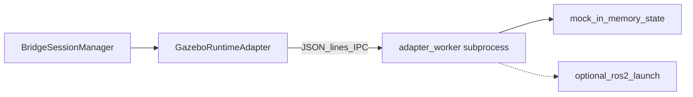

# RT-G2 — Local Gazebo Runtime Adapter Prototype (PLAT-RT-G2)

**Phase:** RT-G2 — local Gazebo/ROS adapter prototype  
**Prerequisite:** PLAN-RT-G1 frozen; PLAT-RT-S6 frozen  
**Authority:** [rt_gazebo_ros_boundary_v1.md](../evaluation/rt_gazebo_ros_boundary_v1.md); [rt_runtime_synchronization_v1.md](../evaluation/rt_runtime_synchronization_v1.md)

## Goal

Implement the first **RT Runtime Adapter** between the frozen RT bridge and a local Gazebo/ROS2 runtime, with **mock-by-default** subprocess IPC and optional live `ros2 launch` for maintainers.

## Architecture



| Module | Role |
|--------|------|
| `runtime_handle.py` | Factory: stub vs adapter |
| `runtime_adapter.py` | Bridge-side adapter client |
| `adapter_worker.py` | Child process; ROS allow-list enforcement |
| `ros_allowlist.py` | Deny-by-default topic rules |
| `adapter_sync.py` | Entity op → IPC pose push |

## Allowed

| Item | Location |
|------|----------|
| Mock adapter (default) | `adapter_mode=mock` |
| Live adapter (maintainer) | `adapter_mode=live`, `ros2` on PATH |
| `enable_gazebo_adapter` flag | `GovernanceConfig`, default **false** |
| `send_runtime_command` sub-commands | `adapter_attach`, `adapter_detach`, `adapter_health` |
| Minimal pose push on entity ops | One-way bridge → adapter |
| Session-scoped topics | `/rt_sandbox/{session_id}/...` |
| Audit extensions | `adapter_attach`, `adapter_teardown`, `orphan_cleanup` |
| `scripts/rt/rt_adapter_inspect.py` | Maintainer read-only inspect |
| Tests | `test_rt_sandbox_bridge.py` (+8 G2 tests) |

## Forbidden

- SA viewer changes; auto replay import; federation writes
- Browser→ROS; rosbridge; parser topic publish (`/tracks/state`, etc.)
- Launch file / world / ROS node source edits in `src/`
- Distributed DDS; multi-session adapter sharing

## Configuration

| Flag | Default | Notes |
|------|---------|-------|
| `enable_gazebo_adapter` | `false` | Stub path when off |
| `adapter_mode` | `mock` | `live` requires `ros2` |
| `adapter_ipc_timeout_s` | `5.0` | IPC round-trip |
| `ros_domain_id_offset` | `42` | Live mode isolation |

## Validation

```bash
python3 -m pytest src/counter_uas/test/test_rt_sandbox_bridge.py -q
```

59 tests at freeze time (51 regression + 8 G2).

## Stop line

No PLAT-RT-G3 stale-sync policy, no G4 telemetry bridge expansion, no G5 capture normalization.

## Related

- [rt_g2_freeze_audit.md](../evaluation/rt_g2_freeze_audit.md)
- [rt_g2_governance_review_r1.md](../evaluation/rt_g2_governance_review_r1.md)
