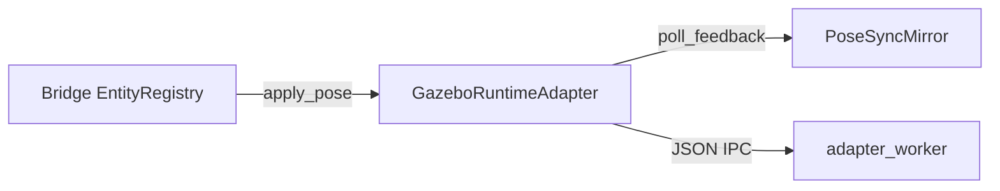

# RT-G3 — Transient Pose Synchronization (PLAT-RT-G3)

**Phase:** RT-G3 — transient pose sync  
**Prerequisite:** PLAT-RT-G2 frozen  
**Authority:** [rt_adapter_feedback_v1.md](../evaluation/rt_adapter_feedback_v1.md); [rt_runtime_synchronization_v1.md](../evaluation/rt_runtime_synchronization_v1.md)

## Goal

Make bridge ↔ adapter ↔ Gazebo/ROS pose synchronization **safe, explicit, and auditable**: command-authoritative registry, adapter-fed feedback mirror, stale/mismatch detection, session-scoped cleanup.

## Architecture



| Module | Role |
|--------|------|
| `pose_sync.py` | Mirror, stale detector, sync health |
| `adapter_sync.py` | Push + poll + mirror update orchestration |
| `adapter_worker.py` | `poll_feedback`, `mock_inject_drift` |
| `session_manager.py` | Entity op sync pipeline, audit events |

## Allowed

| Item | Notes |
|------|-------|
| Feedback mirror (not registry overwrite) | `PoseSyncMirror` on session |
| `poll_feedback` IPC | Mock default; live reads in-memory state |
| Stale/mismatch detection | `SYNC_STALE`, `SYNC_MISMATCH` bridge errors |
| Audit: `sync_update`, `sync_stale`, `sync_mismatch`, `adapter_feedback_lost` | Explanatory only |
| `adapter_resync` maintainer sub-command | Re-push registry poses |
| `world_summary` sync fields | `sync_health`, `feedback_entities` |
| Tests | Mock drift, cleanup, isolation |

## Forbidden

- SA viewer changes; telemetry mirror source change (G4)
- Capture normalization (G5); federation writes
- Registry overwrite from sim feedback
- Parser/topic contract changes; rosbridge
- `rclpy` in bridge process

## Configuration

| Flag | Default | Notes |
|------|---------|-------|
| `pose_sync_enabled` | `true` | Active when adapter enabled |
| `pose_sync_drift_threshold_m` | `2.0` | Stale drift threshold |
| `adapter_feedback_stale_s` | `30.0` | Feedback lost timeout |

## Validation

```bash
python3 -m pytest src/counter_uas/test/test_rt_sandbox_bridge.py -q
```

## Stop line

No G4 telemetry fan-in; no G5 capture normalization; no SA live hooks.

## Related

- [rt_g3_freeze_audit.md](../evaluation/rt_g3_freeze_audit.md)
- [rt_g3_governance_review_r1.md](../evaluation/rt_g3_governance_review_r1.md)
