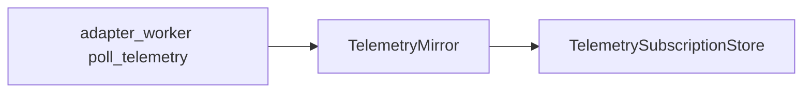

# RT-G4 — Runtime Telemetry Bridge (PLAT-RT-G4)

**Phase:** RT-G4 — adapter-fed telemetry mirrors  
**Prerequisite:** PLAT-RT-G3 frozen  
**Authority:** [rt_adapter_telemetry_v1.md](../evaluation/rt_adapter_telemetry_v1.md)

## Goal

Bridge adapter runtime snapshots into PLAT-RT-S4 telemetry channels with revision/timestamp policy, stale handling, and bounded buffers — without changing EntityRegistry or PoseSyncMirror command authority.

## Architecture

## Allowed

| Item | Notes |
|------|-------|
| `poll_telemetry` IPC | Mock default |
| Adapter-fed `entity_pose_mirror` | Feedback poses only |
| Telemetry audit events | Explanatory only |
| `adapter_poll_telemetry` sub-command | Maintainer |
| `rt_adapter_inspect telemetry-status` | Read-only |

## Forbidden

- SA viewer changes; G5 capture normalization
- Registry overwrite from telemetry
- PoseSyncMirror authority changes
- Parser/topic changes; rosbridge

## Configuration

| Flag | Default |
|------|---------|
| `telemetry_bridge_enabled` | `true` |
| `telemetry_stale_s` | `30.0` |

## Stop line

No G5 capture normalization; no SA live hooks.

## Related

- [rt_g4_freeze_audit.md](../evaluation/rt_g4_freeze_audit.md)
- [rt_g4_governance_review_r1.md](../evaluation/rt_g4_governance_review_r1.md)
