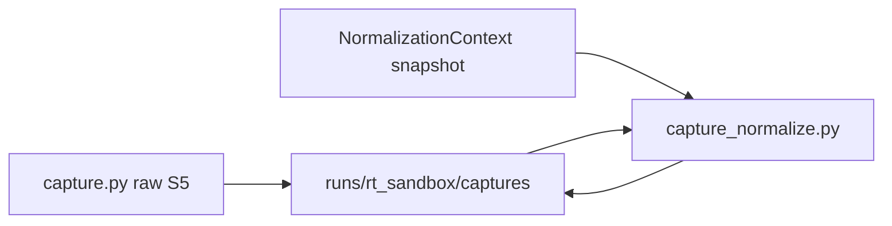

# RT-G5 — Runtime Capture Normalization Foundations (PLAT-RT-G5)

**Phase:** RT-G5 — governance-safe capture normalization  
**Prerequisite:** PLAT-RT-S5, PLAT-RT-G3, PLAT-RT-G4 frozen  
**Authority:** [rt_capture_normalization_v1.md](../evaluation/rt_capture_normalization_v1.md); [rt_sa_export_boundary_v1.md](../evaluation/rt_sa_export_boundary_v1.md)

## Goal

Normalize RT runtime captures into replay-ready staging artifacts with provenance, validation, and redaction — without SA import, federation writes, or bridge command expansion.

## Architecture

Normalization runs at `capture_session` after raw bundle write, **before** world/sync/telemetry teardown.

## Allowed

| Item | Notes |
|------|-------|
| `capture_normalize.py` | Normalized manifest, provenance, validation |
| `normalized_manifest.json` | `rt_normalized_capture_v1` |
| `provenance.json` | `rt_capture_provenance_v1` |
| `normalization_validation.json` | `rt_normalization_validation_v1` |
| Export audit events | `capture_normalized`, `normalization_validation`, `normalization_rejected`, `provenance_injected` |
| `rt_capture_normalize.py` | Maintainer re-normalize (no SA import) |
| `rt_capture_inspect normalization-status` | Read-only |
| Mock-safe stub path | Minimal provenance when adapter off |

## Forbidden

- Automatic SA replay import; `replay_sa_bundle.py` from bridge
- Federation/corpus writes; SA viewer hooks
- New bridge commands (`normalize_capture` forbidden)
- Parser/topic changes; rosbridge
- Operational recording / HITL semantics

## Configuration

| Flag | Default |
|------|---------|
| `capture_normalization_enabled` | `true` |

## Maintainer gate ordering

1. Raw capture (`capture_session`)
2. Normalization (automatic or `rt_capture_normalize.py`)
3. Maintainer approval (`rt_capture_approve.py`)
4. Conversion manifest (`runtime_to_replay_conversion_v1`)
5. External SA packager chain (out of scope)

## Stop line

No automatic SA replay ingestion; no federation publication; no SA viewer runtime integration.

## Related

- [rt_g5_freeze_audit.md](../evaluation/rt_g5_freeze_audit.md)
- [rt_g5_governance_review_r1.md](../evaluation/rt_g5_governance_review_r1.md)
