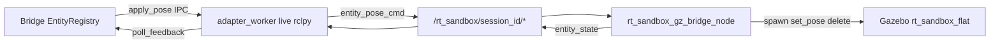

# RT-G6 — Gazebo Runtime Visual Fidelity & Real Runtime Sync (PLAT-RT-G6)

**Phase:** RT-G6 — live Gazebo coupling + visual fidelity  
**Prerequisite:** PLAT-RT-G5, PLAT-RT-R3d, PLAT-RT-T1–T5, PLAT-RT-SA1 frozen  
**Authority:** [rt_adapter_live_sync_v1.md](../evaluation/rt_adapter_live_sync_v1.md); [rt_gazebo_visual_fidelity_v1.md](../evaluation/rt_gazebo_visual_fidelity_v1.md)

## Goal

Close the live Gazebo detachment gap: wire `adapter_worker` to a dedicated RT sandbox Gazebo stack via session-scoped ROS topics, harden pose sync auditability, and surface tri-source sync cognition in the RT UI — mock-by-default, governance-first, additive-only.

## Architecture



| Module | Role |
|--------|------|
| `src/rt_sandbox_gz/` | Dedicated flat world, entity models, gz bridge node, launch |
| `live_ros_client.py` | rclpy client in worker subprocess (bridge stays rclpy-free) |
| `entity_model_map.py` | Entity type → SDF model + ground snap |
| `pose_sync.py` | Stale/missing-entity/lag fields |
| `platform/rt-sandbox-ui/src/sync/` | Tri-source sync cognition |

## Allowed

| Item | Notes |
|------|-------|
| `src/rt_sandbox_gz/` minimal ament package | Flat world, 4 proxy models, bridge node, launch |
| Live ROS publish/subscribe in worker only | Session allow-list topics only |
| Replace `gazebo_target.launch.py` with `rt_sandbox.launch.py` in live mode | No counter-UAS scenario coupling |
| Sync hardening | Stale wiring, missing feedback entity, lag fields, optional yaw drift |
| Additive `world_summary` fields | `feedback_entities`, `last_poll_utc`, `apply_lag_ms`, `adapter_mode` |
| UI sync cognition | Consume existing payloads; fix `pendingReconcile` |
| Audit events | `gz_entity_*`, `sync_lag_observed`, `sync_missing_feedback_entity` |
| `rt_adapter_inspect sync-status --live`, `world-health` | Maintainer read-only |
| Tests | Mock-first; optional `-m g6_live` integration marker |

## Forbidden

- SA viewer / replay ingestion / federation writes
- Browser→ROS direct control; rosbridge; legacy `web/`
- Multi-session UI; distributed runtime; autonomous runtime
- Tactical overlays; HITL/C2 semantics
- Parser/topic contract changes (`/tracks/state`, `/fused_detections`)
- `enable_gazebo_adapter=true` as new default
- Bridge HTTP channel expansion; WebSocket push
- Coupling RT entities to counter-UAS target/interceptor stack

## Configuration

| Flag | Default | Notes |
|------|---------|-------|
| `enable_gazebo_adapter` | `false` | Unchanged |
| `adapter_mode` | `mock` | `live` requires ROS2 + gz + colcon install |
| `rt_sandbox_world` | `rt_sandbox_flat` | Launch world name |
| `pose_sync_yaw_threshold_deg` | `0` | 0 = x/y/z drift only |
| `adapter_live_background_poll_hz` | `0` | Event-driven default |
| `entity_ground_snap_enabled` | `true` | Visual placement realism |

## Validation

```bash
python3 -m pytest src/counter_uas/test/test_rt_sandbox_bridge.py -q
python3 -m pytest src/counter_uas/test/test_rt_g6_live_integration.py -q -m "g6_live"
(cd platform/rt-sandbox-ui && npm test && npm run build)
python3 scripts/rt/lint_rt_runtime_subcommands.py --check
scripts/ci_eval.sh tier0
scripts/ci_eval.sh tier0-rt-ui
```

## Stop line

No multi-session UI; no deeper SA workflow integration; no bridge staging API; no live-default adapter without separate audit.

## Related

- [rt_g6_freeze_audit.md](../evaluation/rt_g6_freeze_audit.md)
- [rt_g6_governance_review_r1.md](../evaluation/rt_g6_governance_review_r1.md)
- [rt_roadmap_g6_v1.md](../evaluation/rt_roadmap_g6_v1.md)
