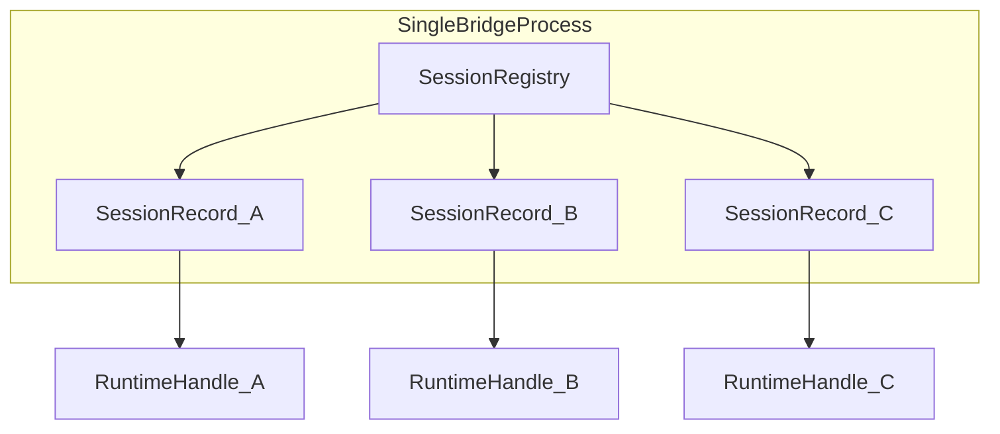

# RT-M1 — Multi-Session Runtime Architecture (PLAN-RT-M1)

**Phase:** PLAN-RT-M1 — multi-session runtime architecture plan  
**Prerequisite:** PLAT-RT-SA1, PLAT-RT-T5, PLAT-RT-G6, PLAT-RT-R3d frozen  
**Build recommendation:** plan-only documentation — **no implementation**  
**Authority:** [AGENTS.md](../../AGENTS.md) remains primary governance. Frozen PLAT-RT-* behavior is unchanged except **additive** M1 supplements.

**Companion artifacts:**

- [rt_multi_session_registry_v1.md](../evaluation/rt_multi_session_registry_v1.md)
- [rt_multi_session_telemetry_routing_v1.md](../evaluation/rt_multi_session_telemetry_routing_v1.md)
- [rt_multi_session_editing_ownership_v1.md](../evaluation/rt_multi_session_editing_ownership_v1.md)
- [rt_multi_session_capture_handoff_v1.md](../evaluation/rt_multi_session_capture_handoff_v1.md)
- [rt_multi_session_governance_v1.md](../evaluation/rt_multi_session_governance_v1.md)
- [rt_multi_session_workstation_ui_v1.md](../evaluation/rt_multi_session_workstation_ui_v1.md)
- [rt_roadmap_m1_m2_v1.md](../evaluation/rt_roadmap_m1_m2_v1.md)
- [rt_m1_governance_review_r1.md](../evaluation/rt_m1_governance_review_r1.md)
- [rt_m1_architecture_review_r1.md](../evaluation/rt_m1_architecture_review_r1.md)
- [rt_m1_freeze_audit.md](../evaluation/rt_m1_freeze_audit.md)

---

## 1. Purpose and scope

### 1.1 Purpose

Define a **governance-safe architecture** for **local multi-session** RT interactive sandbox support — up to three concurrent sessions on a **single bridge process** — without contaminating the frozen SA replay/governance platform or authorizing distributed runtime.

PLAN-RT-M1 is **architecture and contracts only**. It constrains future implementation (PLAT-RT-M2) and preserves SA freeze discipline.

### 1.2 Vocabulary (mandatory)

| Term | Meaning |
|------|---------|
| **Session registry** | Bridge-owned map `session_id → SessionRecord` (replaces sole `_session` slot) |
| **Active session (UI)** | Selected workspace target — full editing, visualization, primary telemetry pull |
| **Background session** | Non-terminal session in registry not currently selected; diagnostics-only in UI |
| **Editing session** | The one session authorized for entity mutation commands from UI |
| **Terminal session** | `discarded` or `captured` — eligible for registry eviction after teardown |
| **RT interactive sandbox** | PLAT-RT-S* transient Browser → Bridge → ROS2/Gazebo workflows |
| **SA sandbox workstation** | Replay-first **read-only** UX (PLAN-SA-H1–H5, frozen) |

Never use “sandbox” alone without **SA** or **RT** qualifier.

### 1.3 Platform identity context

**Current state (frozen):** single-session RT sandbox with SVG + Cesium interactive editing, real Gazebo runtime sync, telemetry UI, capture + normalization, RT→SA manual bridge, workstation UX polish.

**M1 change:** authorize **local single-bridge** multi-session **planning only** — not implementation.

### 1.4 In scope (PLAN-RT-M1)

| In scope | Out of scope |
|----------|--------------|
| Session registry architecture | Implementation (`platform/rt-sandbox-bridge/`, `platform/rt-sandbox-ui/`) |
| Telemetry routing per session | Distributed runtime / multi-bridge |
| World editing ownership rules | SA viewer integration |
| Capture/handoff isolation | Automatic replay ingestion |
| Governance protections + caps | Federation integration |
| UX planning (tabs, workspace, diagnostics) | Cloud / multi-user / tactical UX |
| Roadmap M1→M2 | Autonomous runtime behavior |

---

## 2. Current single-session baseline

Today's RT sandbox is **intentionally single-session**. Enforcement is structural:

| Layer | Single-session enforcement |
|-------|---------------------------|
| Bridge facade | `BridgeSessionManager._session: SessionRecord \| None` — one slot |
| `start_session` | Rejects when prior session is non-terminal and active/stopped/failed/cleanup_pending |
| Command routing | All commands require `session_id` matching sole `_session` |
| Governance constant | `max_concurrent_sessions = 1` in `governance.py` — **documented but unwired** |
| Telemetry store | Keyed by `session_id` (dict shape) but only one live session at a time |
| UI | `useRtSession.ts` — single `sessionId`, single pull loop |
| Product docs | `rt_roadmap_post_g5_v1.md` forbids multi-session until new wave audit |

Partial multi-session **shapes** exist (`TelemetrySubscriptionStore._by_session`, `ros_domain_id_for_session()`), but behavior is single-slot.

---

## 3. Session registry

See [rt_multi_session_registry_v1.md](../evaluation/rt_multi_session_registry_v1.md).



| Concern | Rule |
|---------|------|
| **Creation** | `start_session` when `non_terminal_count < max_concurrent_sessions` (3) |
| **Active vs background** | UI-only designation; lifecycle states unchanged |
| **Removal** | Terminal states → teardown → registry eviction |
| **Ownership** | Bridge owns registry; UI owns `selectedSessionId` + `editingSessionId` |
| **ROS isolation** | `ros_domain_id_for_session(session_id)` per adapter session |

New bridge commands (docs-only until M2): `list_sessions`, `set_editing_session`.

---

## 4. Telemetry routing

See [rt_multi_session_telemetry_routing_v1.md](../evaluation/rt_multi_session_telemetry_routing_v1.md).

| Session role | Pull rate | Channels |
|--------------|-----------|----------|
| **Active (UI)** | ≤ 10 Hz | Full allow-list (5 channels) |
| **Background** | ≤ 1 Hz | `session_health`, `lifecycle_state`, `world_summary` (entity count only) |

- Pull API unchanged — already session-scoped via `session_id` + `subscription_id`
- Destructive drain scoped per subscription; no cross-session channel merge
- Mirror isolation: each `SessionRecord` owns `pose_sync` / `telemetry_mirror`; UI snapshots keyed by `sessionId`

---

## 5. World editing ownership

See [rt_multi_session_editing_ownership_v1.md](../evaluation/rt_multi_session_editing_ownership_v1.md).

- Exactly **one editing session** at a time
- Entity commands (`spawn_entity`, `move_entity`, `delete_entity`) require matching `session_id`, non-terminal lifecycle, `running`/`paused`, and bridge-stored `editing_session_id`
- Background sessions are UI-read-only; bridge rejects edits with `EDITING_SESSION_MISMATCH`
- SVG + Cesium dual-surface edits bind to the same editing session
- Local entity mirror scoped per session (M2 requirement)

---

## 6. Capture / handoff

See [rt_multi_session_capture_handoff_v1.md](../evaluation/rt_multi_session_capture_handoff_v1.md).

- Each session captures independently from `stopped` state
- Staging: `runs/rt_sandbox/captures/<capture_candidate_id>/` — unchanged
- `session_id` stored as `ephemeral_session_ref` — not SA lineage
- `max_staged_captures = 32` shared globally across all sessions
- Handoff CLIs operate per `capture_candidate_id`; no session-to-session promotion
- Capture of session A must not read session B world state

---

## 7. Governance protections

See [rt_multi_session_governance_v1.md](../evaluation/rt_multi_session_governance_v1.md).

| Protection | Rule |
|------------|------|
| No cross-session leakage | Audit, telemetry drain, world registry, capture snapshots are session-scoped |
| Cleanup guarantees | Per-session teardown via `session_teardown.py`; one session `failed` does not auto-discard siblings |
| Caps | `max_concurrent_sessions = 3`; per-session entity/duration/rate limits unchanged |
| Aggregate limit | `max_total_entities_across_sessions = 64` (doc-only governance constant) |
| Authority boundaries | Mirrors ≠ authority; SA viewer unchanged; no federation writes |

**Forbidden (unchanged):** horizontal scaling, session pooling, load balancing, multi-user collaboration rooms, cloud orchestration.

---

## 8. UX planning

See [rt_multi_session_workstation_ui_v1.md](../evaluation/rt_multi_session_workstation_ui_v1.md).

Extends PLAT-RT-T4 workstation:

```
┌─ Governance banners (+ multi-session banner) ─────┐
├─ Session rail: [Tab A*] [Tab B] [Tab C] [+ New] ─┤
├─ Active workspace (selected tab) ─────────────────┤
│  World column | Viz column | Mirrors column       │
├─ Background diagnostics (collapsed accordion) ────┤
├─ Pipeline footer (capture for selected session) ──┤
└─ Diagnostics ─────────────────────────────────────┘
```

- `+ New` disabled at capacity with explanatory copy
- Tab click promotes to active/editing (confirm if unsaved local mirror edits)
- Per-tab disconnect, not global

---

## 9. Allowed / forbidden (PLAN-RT-M1 wave)

### Allowed

- Documentation under `docs/platform/` and `docs/evaluation/rt_multi_session_*`, `rt_m1_*`
- Additive sections to `rt_bridge_contract_v1.md`, `rt_session_manager_ownership_v1.md`
- PLAN-RT-M1 registry row + AGENTS pointer
- Roadmap M1→M2

### Forbidden

- `platform/rt-sandbox-bridge/` code changes
- `platform/rt-sandbox-ui/` code changes
- `platform/sa-r0-viewer/` changes
- Parser/topic/schema changes
- Distributed runtime / multi-bridge
- SA viewer integration / automatic replay ingestion
- Federation/orchestration semantic changes

---

## 10. Validation and stop line

| Check | Method |
|-------|--------|
| Governance review | [rt_m1_governance_review_r1.md](../evaluation/rt_m1_governance_review_r1.md) |
| Architecture review | [rt_m1_architecture_review_r1.md](../evaluation/rt_m1_architecture_review_r1.md) |
| RT↔SA boundary review | Governance review §5 |
| No SA contamination | SA viewer/orchestration unchanged |
| Hardening | Leakage rules, caps, cleanup guarantees documented |

**Stop line:** End PLAN-RT-M1 after freeze audit. **Do not** start PLAT-RT-M2 implementation.

---

## 11. PLAT-RT-M2 implementation prerequisites (document only)

Bridge (future):

1. Replace `_session` with `SessionRegistry` + capacity wiring
2. Per-session `RateLimiter`
3. Per-session `tick_timeouts`
4. Commands: `list_sessions`, `set_editing_session`
5. Thread-safe registry for `ThreadingHTTPServer`
6. Multiple concurrent `RuntimeHandle` instances
7. Integration tests: 3 concurrent sessions, capacity rejection, editing lock, capture isolation

UI (future):

1. Refactor `useRtSession.ts` → multi-session workspace hook
2. Session tab component in session rail
3. Per-session snapshot/local mirror state maps
4. Background diagnostics panel

---

## 12. Related (frozen)

- [rt_session_lifecycle_v1.md](../evaluation/rt_session_lifecycle_v1.md)
- [rt_session_manager_ownership_v1.md](../evaluation/rt_session_manager_ownership_v1.md)
- [rt_runtime_workstation_ui_v1.md](../evaluation/rt_runtime_workstation_ui_v1.md)
- [rt_runtime_governance_v1.md](../evaluation/rt_runtime_governance_v1.md)
- [rt_roadmap_post_g5_v1.md](../evaluation/rt_roadmap_post_g5_v1.md)
- [freeze_registry_r1.md](../evaluation/freeze_registry_r1.md)
