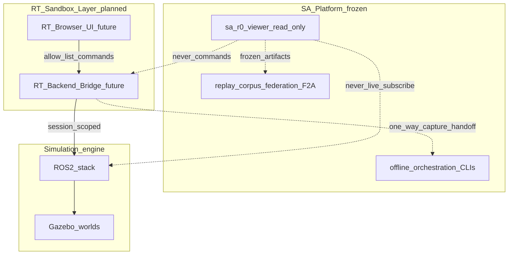

# RT-S1 — Interactive Runtime Simulation Sandbox (PLAN-RT-S1)

**Phase:** RT-S1 — Interactive Runtime Simulation Sandbox Plan  
**Checkpoint:** `6965336` (PLAT-SA-F2A freeze: multi-corpus federation foundations)  
**Build recommendation:** plan-only documentation — **no implementation**  
**Authority:** [AGENTS.md](../../AGENTS.md) remains primary governance. Frozen PLAT-SA-* behavior is unchanged.

**Companion artifacts:**

- [rt_bridge_contract_v1.md](../evaluation/rt_bridge_contract_v1.md)
- [rt_session_lifecycle_v1.md](../evaluation/rt_session_lifecycle_v1.md)
- [rt_sa_export_boundary_v1.md](../evaluation/rt_sa_export_boundary_v1.md)
- [rt_runtime_governance_v1.md](../evaluation/rt_runtime_governance_v1.md)
- [rt_capture_continuity_v1.md](../evaluation/rt_capture_continuity_v1.md)
- [rt_roadmap_s2_s6_v1.md](../evaluation/rt_roadmap_s2_s6_v1.md)
- [rt_s1_governance_review_r1.md](../evaluation/rt_s1_governance_review_r1.md)
- [rt_s1_freeze_audit.md](../evaluation/rt_s1_freeze_audit.md)
- [rt_s1_architecture_readiness_review_r1.md](../evaluation/rt_s1_architecture_readiness_review_r1.md)

---

## 1. Purpose and scope

### 1.1 Purpose

Define a **governance-safe architecture** for the **RT interactive sandbox** — transient, interactive runtime simulation workflows — **without contaminating** the frozen SA replay/governance platform.

RT-S1 is **architecture and contracts only**. It constrains future implementation waves (RT-S2+) and preserves SA freeze discipline.

### 1.2 Vocabulary (mandatory)

| Term | Meaning |
|------|---------|
| **SA sandbox workstation** | Replay-first **read-only** UX (PLAN-SA-H1–H5, frozen) |
| **RT-1..RT-7** (registry) | Runtime **realism** waves — unrelated to RT-S |
| **RT interactive sandbox** | PLAT-RT-S* transient Browser → Bridge → ROS2/Gazebo workflows |

Never use “sandbox” alone without **SA** or **RT** qualifier.

### 1.3 Platform identity context

**SA Platform (frozen):** governance-aware replay experimentation, deterministic authoring/orchestration, async-safe replay generation, recovery/reconciliation review, federated replay research, publication ecosystem on ROS2/Gazebo substrate.

**RT Sandbox Layer (new, separate branch):** interactive runtime simulation — **not** replay governance, publication ecosystem, or operational command platform.

### 1.4 In scope (RT-S1)

| In scope | Out of scope |
|----------|--------------|
| Three-layer architecture | WebSocket / rosbridge implementation |
| Bridge contract v1 (docs) | Runtime bridge code |
| Session lifecycle + failure states | SA viewer changes |
| RT↔SA export boundary | Federation/orchestration authority |
| Governance + resource limits | Cloud / multi-user / tactical UX |
| Roadmap RT-S2–S6 | Production security infra |

---

## 2. Architecture split

| Layer | Authority | Transient vs deterministic |
|-------|-----------|---------------------------|
| **SA Platform** | Replay artifacts, corpus/federation indexes | Deterministic offline |
| **RT Sandbox** | Session-scoped bridge commands only | Transient until capture candidate |
| **Gazebo/ROS2** | Runtime truth while session active | Ephemeral process state |

### 2.1 Authority ownership

- **Browser UI:** intent only — no ROS credentials, no direct publish/subscribe.
- **RT Backend Bridge:** sole interactive command gate; deny-by-default; rate limits per [rt_runtime_governance_v1.md](../evaluation/rt_runtime_governance_v1.md).
- **ROS2/Gazebo:** runtime execution; torn down on discard/failure cleanup.
- **SA tooling:** exclusive owner of replay bundles, corpus lineage, federation after export pipeline.

**Frozen SA rule (unchanged):** Web platform orchestrates offline jobs; Gazebo runs for maintainer capture; **SA viewer never launches sim or subscribes to topics.** RT-S1 adds: **only RT Bridge** may command runtime during an RT session, and **never** from `platform/sa-r0-viewer/`.

---

## 3. Browser / bridge / runtime boundaries

| Boundary | Rule |
|----------|------|
| Browser ↔ Bridge | Local RPC only (future); governance banners on every response |
| Bridge ↔ ROS | Bridge holds process credentials; browser does not |
| Bridge ↔ SA | Capture candidate handoff only; no federation writes |
| SA viewer ↔ RT | **No connection** |

Runtime isolation: see [experiment_orchestration_async_safety_v1.md](../evaluation/experiment_orchestration_async_safety_v1.md) — SA async prohibitions apply to RT separation from SA viewer.

---

## 4. Transient vs deterministic layers

| Concern | RT (transient) | SA (deterministic) |
|---------|----------------|-------------------|
| Session state | RAM / child processes | Frozen JSON bundles |
| Telemetry | Session buffer | Not applicable live |
| Lineage | `session_id` ephemeral | `run_id`, `bundle_path`, `corpus_ref` |
| Federation | No authority | F2A frozen indexes |

---

## 5. UX separation

### 5.1 Mode comparison

| Mode | User goal | Chrome | Forbidden |
|------|-----------|--------|-----------|
| **SA replay workstation** | Explain frozen evidence | Five segments, REPLAY/CORPUS banners | Launch sim, live map merge |
| **RT interactive sandbox** | Prototype simulation behavior | Single-task sandbox shell (future) | Compare ranking, federation nav, queue control |

### 5.2 RT language requirements

RT UX must be **experimental**, **sandbox-oriented**, **simulation-oriented** — **not** tactical, operational, or military C2.

**Required banners:**

- `RT SANDBOX — experimental simulation; not operational state`
- `TRANSIENT SESSION — not replay authority`
- Capture (future): `CAPTURE CANDIDATE — requires validation before replay import`

**Forbidden terms:** `engage`, `intercept`, `strike`, `target lock`, `mission approval`, `operator authorization`, `tactical readiness`, `command authority`, and operational defeat/kill/neutralize language.

Preferred alternatives: simulate, reposition entity, select/highlight, session control, sandbox status. Full list: [rt_runtime_governance_v1.md](../evaluation/rt_runtime_governance_v1.md) §7.

Align forbidden presentation layers with [situational_awareness_ui_planning_r1.md](../evaluation/situational_awareness_ui_planning_r1.md) — no command palette, readiness gauge, HITL approval, or live battle merge.

---

## 6. Maintainer capture vs RT session

Frozen path: [experiment_workflow_scenario_to_replay_v1.md](../evaluation/experiment_workflow_scenario_to_replay_v1.md) — `run_capture.py` via `run_experiment_queue.py --allow-runtime-capture`.

**CLI maintainer capture ≠ RT interactive session.** RT capture handoff is documented in [rt_sa_export_boundary_v1.md](../evaluation/rt_sa_export_boundary_v1.md); implementation deferred to RT-S5.

---

## 7. Deliverables (RT-S1)

| ID | Document |
|----|----------|
| S1.1 | This plan |
| S1.2 | [rt_bridge_contract_v1.md](../evaluation/rt_bridge_contract_v1.md) |
| S1.3 | [rt_session_lifecycle_v1.md](../evaluation/rt_session_lifecycle_v1.md) |
| S1.4 | [rt_sa_export_boundary_v1.md](../evaluation/rt_sa_export_boundary_v1.md) |
| S1.5 | [rt_runtime_governance_v1.md](../evaluation/rt_runtime_governance_v1.md) |
| S1.6 | [rt_capture_continuity_v1.md](../evaluation/rt_capture_continuity_v1.md) |
| S1.7 | [rt_roadmap_s2_s6_v1.md](../evaluation/rt_roadmap_s2_s6_v1.md) |
| S1.8 | [rt_s1_governance_review_r1.md](../evaluation/rt_s1_governance_review_r1.md) |
| S1.9 | [rt_s1_freeze_audit.md](../evaluation/rt_s1_freeze_audit.md) |
| S1.10 | [rt_s1_architecture_readiness_review_r1.md](../evaluation/rt_s1_architecture_readiness_review_r1.md) |
| S1.11 | Registry + AGENTS pointers |

---

## 8. Allowed / forbidden (RT-S1 wave)

### Allowed

- Documentation under `docs/platform/` and `docs/evaluation/rt_*`
- PLAN-RT-S1 registry row
- AGENTS third-frontier section

### Forbidden

- `platform/sa-r0-viewer/` changes
- `src/`, launch files, Gazebo worlds, orchestration scripts
- Backend services, websocket/rosbridge/runtime bridge **code**
- Parser/topic/schema changes
- Federation/orchestration semantic changes

---

## 9. Validation and stop line

| Check | Method |
|-------|--------|
| Governance review | [rt_s1_governance_review_r1.md](../evaluation/rt_s1_governance_review_r1.md) |
| Replay-boundary review | Export boundary + lineage rules |
| No SA contamination | SA viewer/orchestration unchanged |
| Hardening | Resource limits, failure states, capture approval, lexicon, bridge security |

**Stop line:** End RT-S1 after freeze audit draft. **Do not** start RT-S2 bridge implementation.

---

## 10. Related (frozen SA)

- [h1_sandbox_ux_architecture_plan.md](h1_sandbox_ux_architecture_plan.md) — SA replay workstation (not RT)
- [sa_f2a_multi_corpus_federation_plan.md](../evaluation/sa_f2a_multi_corpus_federation_plan.md)
- [freeze_registry_r1.md](../evaluation/freeze_registry_r1.md)
