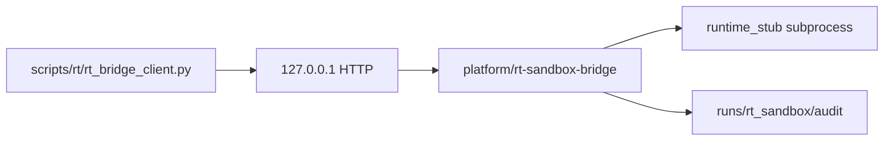

# RT-S2 — Local Runtime Bridge Prototype (PLAT-RT-S2)

**Phase:** RT-S2 — runtime bridge prototype  
**Prerequisite:** PLAN-RT-S1 frozen — [rt_s1_freeze_audit.md](../evaluation/rt_s1_freeze_audit.md)  
**Authority:** [rt_bridge_contract_v1.md](../evaluation/rt_bridge_contract_v1.md); [rt_s1_architecture_readiness_review_r1.md](../evaluation/rt_s1_architecture_readiness_review_r1.md)

## Goal

Implement the **smallest governance-safe** local RT bridge prototype: loopback HTTP, transient session manager, runtime **stub** (no Gazebo/ROS), append-only audit log, CLI test harness.

## Architecture



## Allowed

| Item | Location |
|------|----------|
| Bridge package | `platform/rt-sandbox-bridge/rt_sandbox/` |
| Start bridge | `scripts/rt/run_rt_bridge.py` |
| CLI client | `scripts/rt/rt_bridge_client.py` |
| Session commands | `start_session`, `pause_session`, `resume`, `stop_session`, `discard_session` |
| Failure/cleanup states | per [rt_session_lifecycle_v1.md](../evaluation/rt_session_lifecycle_v1.md) |
| Audit log | `runs/rt_sandbox/audit/<session_id>.json` |
| Tests | `src/counter_uas/test/test_rt_sandbox_bridge.py` |

## Forbidden

- `platform/sa-r0-viewer/` changes
- `capture_session`, entity ops, telemetry subscribe
- rosbridge, legacy `web/` extension
- Writes under `fixtures/sa_r0/`, federation, orchestration
- Gazebo/ROS launch in RT-S2

## Validation

```bash
python3 -m pytest src/counter_uas/test/test_rt_sandbox_bridge.py -q
python3 scripts/rt/run_rt_bridge.py --port 18765 &
python3 scripts/rt/rt_bridge_client.py start_session
```

## Stop line

No RT-S3 `spawn_entity` / `move_entity` without new wave audit.

## Related

- [rt_s2_freeze_audit.md](../evaluation/rt_s2_freeze_audit.md)
- [rt_roadmap_s2_s6_v1.md](../evaluation/rt_roadmap_s2_s6_v1.md)
