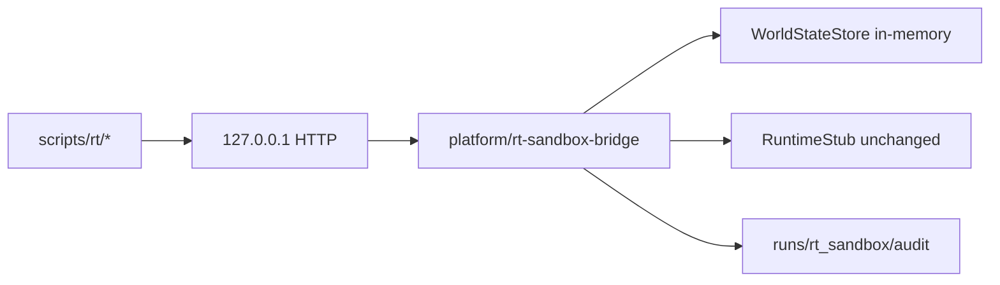

# RT-S3 — Interactive Entity Sandbox Foundations (PLAT-RT-S3)

**Phase:** RT-S3 — transient runtime entity editing  
**Prerequisite:** PLAN-RT-S1 frozen; PLAT-RT-S2 frozen — [rt_s2_freeze_audit.md](../evaluation/rt_s2_freeze_audit.md)  
**Authority:** [rt_bridge_contract_v1.md](../evaluation/rt_bridge_contract_v1.md); [rt_runtime_governance_v1.md](../evaluation/rt_runtime_governance_v1.md)

## Goal

Implement the first **governance-safe** interactive entity workflows inside the isolated RT runtime branch: transient entity registry, session world state, spawn/move/delete prototype commands, extended audit/telemetry, and optional CLI visualization — **without** Gazebo/ROS integration or SA contamination.

## Architecture



Entity/world state lives in the bridge process. `RuntimeStub` remains the RT-S2 sleep subprocess (no pose sync, no new orchestration).

## Allowed

| Item | Location |
|------|----------|
| Entity registry | `platform/rt-sandbox-bridge/rt_sandbox/entity_registry.py` |
| World state store | `platform/rt-sandbox-bridge/rt_sandbox/world_state.py` |
| Commands | `spawn_entity`, `move_entity`, `delete_entity`, `reset_session` |
| Entity catalog | `radar`, `interceptor`, `drone`, `waypoint_marker` (≤8 each, ≤32 total) |
| World bounds | `x,y ∈ [-500,500]`, `z ∈ [0,200]` |
| Internal telemetry | `entity_pose_heartbeat`, `world_summary` (not `subscribe_telemetry`) |
| Optional CLI viz | `scripts/rt/rt_world_viz.py` |
| Tests | `src/counter_uas/test/test_rt_sandbox_bridge.py` |

## Forbidden

- Gazebo/ROS integration; rosbridge; legacy `web/` extension
- `platform/sa-r0-viewer/` changes
- `capture_session`, `subscribe_telemetry`, federation/orchestration/corpus writes
- Tactical/HITL semantics; operational visualization
- Persistence outside `runs/rt_sandbox/audit/` (world state memory-only)
- Browser→ROS authority; distributed runtime infra

## Entity catalog (RT-S3 v1)

| `entity_type` | Max | Notes |
|---------------|-----|-------|
| `radar` | 8 | Static/sensor placeholder |
| `interceptor` | 8 | Movable sandbox actor (not engage/intercept commands) |
| `drone` | 8 | Movable sandbox actor |
| `waypoint_marker` | 8 | Static marker |
| **Total** | 32 | `max_entity_count` |

## Validation

```bash
python3 -m pytest src/counter_uas/test/test_rt_sandbox_bridge.py -q
```

## Stop line

No RT-S4 `subscribe_telemetry` or SA viewer live hooks. No RT-S5 `capture_session` pipeline.

## Related

- [rt_s3_freeze_audit.md](../evaluation/rt_s3_freeze_audit.md)
- [rt_s3_governance_review_r1.md](../evaluation/rt_s3_governance_review_r1.md)
- [rt_roadmap_s2_s6_v1.md](../evaluation/rt_roadmap_s2_s6_v1.md)
