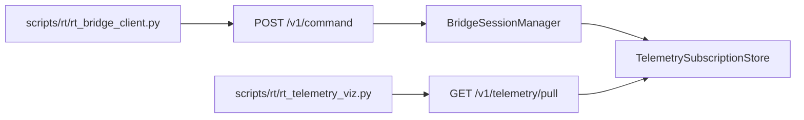

# RT-S4 — Runtime Telemetry and Sandbox Visualization Foundations (PLAT-RT-S4)

**Phase:** RT-S4 — telemetry subscriptions and RT-only visualization  
**Prerequisite:** PLAN-RT-S1, PLAT-RT-S2, PLAT-RT-S3 frozen  
**Authority:** [rt_bridge_contract_v1.md](../evaluation/rt_bridge_contract_v1.md); [rt_runtime_governance_v1.md](../evaluation/rt_runtime_governance_v1.md)

## Goal

Add **session-scoped telemetry subscriptions** with local-only pull transport, bounded 10 Hz delivery, audit records, and an RT-only CLI visualization — without Gazebo/ROS, SA viewer changes, or capture/federation paths.

## Architecture



## Allowed

| Item | Location |
|------|----------|
| subscribe_telemetry / unsubscribe_telemetry | governance allow-list |
| Telemetry channels | session_health, lifecycle_state, world_summary, entity_pose_mirror, clock_mirror |
| Pull transport | GET /v1/telemetry/pull (loopback only) |
| Subscription store | `telemetry_subscriptions.py` |
| RT-only viz | `scripts/rt/rt_telemetry_viz.py` |
| Tests | `test_rt_sandbox_bridge.py` |

## Forbidden

- Gazebo/ROS; rosbridge; `platform/sa-r0-viewer/`
- `capture_session`; federation/orchestration/corpus writes
- Tactical dashboards; operational semantics
- WebSocket in SA viewer; live merge into SA compare clock

## Telemetry caps

| Limit | Value |
|-------|-------|
| Aggregate rate | 10 Hz per session |
| Channels per subscription | 5 |
| Active subscriptions per session | 1 (resubscribe replaces) |
| Ring buffer | 64 events |

## Validation

```bash
python3 -m pytest src/counter_uas/test/test_rt_sandbox_bridge.py -q
```

## Stop line

No RT-S5 `capture_session` or SA export pipeline.

## Related

- [rt_s4_freeze_audit.md](../evaluation/rt_s4_freeze_audit.md)
- [rt_s4_governance_review_r1.md](../evaluation/rt_s4_governance_review_r1.md)
