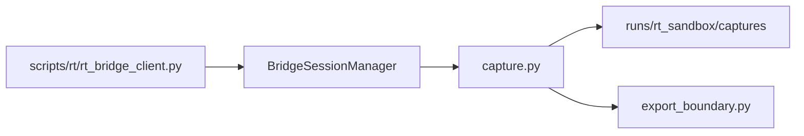

# RT-S5 — Runtime Capture and Replay Boundary Foundations (PLAT-RT-S5)

**Phase:** RT-S5 — governance-safe runtime capture and RT↔SA export isolation  
**Prerequisite:** PLAN-RT-S1, PLAT-RT-S2, PLAT-RT-S3, PLAT-RT-S4 frozen  
**Authority:** [rt_sa_export_boundary_v1.md](../evaluation/rt_sa_export_boundary_v1.md); [rt_capture_continuity_v1.md](../evaluation/rt_capture_continuity_v1.md)

## Goal

Implement the first **governance-safe runtime capture/export foundations** while preserving strict RT↔SA separation: `capture_session` from `stopped` only, RT-only staging artifacts, explicit export-boundary enforcement, capture audit logs, and minimal maintainer inspection CLIs — without Gazebo/ROS, SA viewer changes, or automatic replay import.

## Architecture



## Allowed

| Item | Location |
|------|----------|
| capture_session | governance allow-list; stopped → captured |
| Staging artifacts | `runs/rt_sandbox/captures/<id>/` |
| Export boundary | `export_boundary.py`, `export_audit_log.py` |
| Capture module | `capture.py` |
| Maintainer CLIs | `rt_capture_inspect.py`, `rt_capture_approve.py` |
| Tests | `test_rt_sandbox_bridge.py` |

## Forbidden

- Gazebo/ROS; rosbridge; `platform/sa-r0-viewer/`
- Automatic SA replay import; federation/orchestration/corpus writes
- H3 queue merge; operational semantics; distributed capture infra
- `replay_sa_bundle.py` / federation CLIs invoked from bridge

## Capture caps

| Limit | Value |
|-------|-------|
| max_capture_bundle_bytes | 5 MiB |
| max_staged_captures | 32 |

## Validation

```bash
python3 -m pytest src/counter_uas/test/test_rt_sandbox_bridge.py -q
```

## Stop line

No RT-S6 advanced workflows; no Gazebo/ROS; no SA replay ingestion from bridge.

## Related

- [rt_s5_freeze_audit.md](../evaluation/rt_s5_freeze_audit.md)
- [rt_s5_governance_review_r1.md](../evaluation/rt_s5_governance_review_r1.md)
