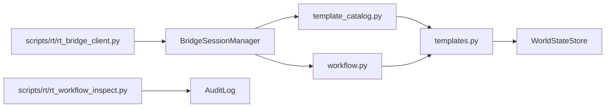

# RT-S6 — Sandbox Scenario Templates & Multi-Step Workflows (PLAT-RT-S6)

**Phase:** RT-S6 — governance-safe sandbox workflow composition  
**Prerequisite:** PLAN-RT-S1, PLAT-RT-S2 through PLAT-RT-S5 frozen  
**Authority:** [rt_workflow_contract_v1.md](../evaluation/rt_workflow_contract_v1.md); [rt_bridge_contract_v1.md](../evaluation/rt_bridge_contract_v1.md)

## Goal

Implement transient RT-only runtime templates, session-scoped multi-step workflows, workflow audit extensions, and maintainer inspection CLIs — without Gazebo/ROS, SA viewer changes, or automatic replay/federation/orchestration writes.

## Architecture



## Allowed

| Item | Location |
|------|----------|
| Runtime template catalog | `template_catalog.py`, `templates.py` |
| Workflow engine | `workflow.py` |
| Template/workflow commands | `governance.py`, `session_manager.py` |
| Workflow inspect CLI | `scripts/rt/rt_workflow_inspect.py` |
| Capture workflow metadata | additive `capture_report` fields |
| Tests | `test_rt_sandbox_bridge.py` |

## Forbidden

- Gazebo/ROS; rosbridge; `platform/sa-r0-viewer/`
- Automatic SA replay import; federation/orchestration/corpus writes
- Persistent template store outside session memory
- Operational/mission-planning semantics

## Workflow caps

| Limit | Value |
|-------|-------|
| max_runtime_templates_in_catalog | 16 |
| max_entities_per_template_apply | 8 |
| max_template_applies_per_session | 32 |
| max_workflows_in_catalog | 8 |
| max_workflow_steps | 12 |

## Validation

```bash
python3 -m pytest src/counter_uas/test/test_rt_sandbox_bridge.py -q
```

## Stop line

No Gazebo/ROS runtime integration; no SA replay ingestion from bridge.

## Related

- [rt_s6_freeze_audit.md](../evaluation/rt_s6_freeze_audit.md)
- [rt_s6_governance_review_r1.md](../evaluation/rt_s6_governance_review_r1.md)
