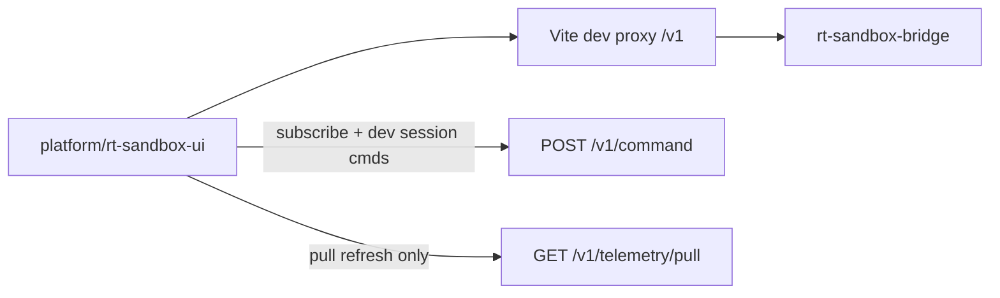

# RT-T1 — Runtime Telemetry UI Foundations (PLAT-RT-T1)

**Phase:** PLAT-RT-T1 — RT-only browser telemetry visualization (expansion wave)  
**Prerequisite:** PLAT-RT-R3d frozen; P2 maintenance complete  
**Authority:** [rt_roadmap_post_g5_v1.md](../evaluation/rt_roadmap_post_g5_v1.md); [rt_runtime_governance_v1.md](../evaluation/rt_runtime_governance_v1.md); [rt_telemetry_ui_v1.md](../evaluation/rt_telemetry_ui_v1.md)

## Goal

Create the first **RT-only browser visualization surface** using the existing loopback pull telemetry model (PLAT-RT-S4 / PLAT-RT-G4). Display session lifecycle, health, world summary, entity pose mirror, and clock mirror with mandatory governance banners and telemetry cognition — without SA viewer changes, Cesium, or bridge semantic changes.

## Architecture



## Allowed

| Item | Location / notes |
|------|------------------|
| RT-only browser UI | `platform/rt-sandbox-ui/` |
| Loopback HTTP client | Vite proxy → `127.0.0.1:18765` |
| Pull refresh telemetry | Five frozen S4 channels |
| Governance chrome | Three persistent banners |
| Telemetry cognition | `src/telemetry/cognition.ts` |
| 2D entity grid | ASCII-equivalent; not Cesium |
| Dev session workflow | start/subscribe/pull/unsubscribe/stop |
| Refresh + diagnostics | Manual + interval pull (≤10 Hz) |
| Tests | Vitest + Python isolation test |
| CI tier | `tier0-rt-ui` in `scripts/ci_eval.sh` |
| Contract | [rt_telemetry_ui_v1.md](../evaluation/rt_telemetry_ui_v1.md) |

## Forbidden

- Any edits to `platform/sa-r0-viewer/`
- Cesium / geospatial map engine
- Drag/drop entity editing (RT-T2)
- WebSocket / SSE push telemetry
- SA replay ingestion; federation/corpus writes
- Browser→ROS direct; rosbridge; legacy `web/` extension
- New bridge commands or telemetry channels
- Multi-session UI; tactical/HITL/ops-dashboard semantics
- Changing `enable_gazebo_adapter` default
- Bridge behavior changes (prefer Vite proxy over CORS)

## Validation

```bash
python3 scripts/rt/lint_rt_runtime_subcommands.py --check
python3 -m pytest src/counter_uas/test/test_rt_sandbox_bridge.py -q
(cd platform/rt-sandbox-ui && npm ci && npm test && npm run build)
scripts/ci_eval.sh tier0
scripts/ci_eval.sh tier0-rt-ui
```

## Stop line

PLAT-RT-T1 frozen. Do not start RT-T2 (drag/drop world editing), Cesium runtime viz, or SA bridge **implementation** without explicit new wave audit.

## Related

- [rt_t1_governance_review_r1.md](../evaluation/rt_t1_governance_review_r1.md)
- [rt_t1_freeze_audit.md](../evaluation/rt_t1_freeze_audit.md)
- [rt_s4_telemetry_visualization_plan.md](rt_s4_telemetry_visualization_plan.md) (S4 CLI baseline; T1 is browser consumer)
