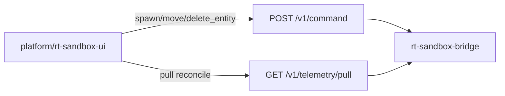

# RT-T2 — Drag/Drop + Runtime World Editing (PLAT-RT-T2)

**Phase:** PLAT-RT-T2 — RT-only interactive world editing UI (expansion wave)  
**Prerequisite:** PLAT-RT-T1 frozen  
**Authority:** [rt_roadmap_post_g5_v1.md](../evaluation/rt_roadmap_post_g5_v1.md); [rt_world_editing_ui_v1.md](../evaluation/rt_world_editing_ui_v1.md); [rt_bridge_contract_v1.md](../evaluation/rt_bridge_contract_v1.md)

## Goal

Add the first **interactive runtime world editing UI** on top of frozen PLAT-RT-T1. Entity palette, click-to-place, drag-to-move, and delete via existing RT-S3 bridge commands — preserving pull-only telemetry, governance banners, and strict SA isolation.

## Architecture



## Allowed

| Item | Location / notes |
|------|------------------|
| World editing UI | Extend `platform/rt-sandbox-ui/` |
| Entity commands | `spawn_entity`, `move_entity`, `delete_entity` |
| Entity palette | radar, interceptor, drone, waypoint_marker |
| Interactive SVG grid | click-place, drag-move, delete |
| Fourth banner | `WORLD EDITING ACTIVE` when connected |
| Editing cognition | `src/editing/cognition.ts` |
| Edit history UI | Session-local ring buffer (no persistence) |
| Client-side bounds/caps | Mirror `governance.py` constants |
| Tests | Vitest + pytest isolation extension |

## Forbidden

- Any edits to `platform/sa-r0-viewer/`
- Cesium / geospatial map
- New bridge commands or telemetry channels
- WebSocket / push telemetry
- SA replay ingestion; federation/corpus writes
- Browser→ROS direct; rosbridge; legacy `web/`
- Hidden persistence (localStorage, file writes)
- Multi-session UI; tactical/HITL/ops-dashboard semantics
- Bridge behavior changes

## Validation

```bash
python3 scripts/rt/lint_rt_runtime_subcommands.py --check
python3 -m pytest src/counter_uas/test/test_rt_sandbox_bridge.py -q
(cd platform/rt-sandbox-ui && npm ci && npm test && npm run build)
scripts/ci_eval.sh tier0
scripts/ci_eval.sh tier0-rt-ui
```

## Stop line

PLAT-RT-T2 frozen. Do not start RT-T3 (Cesium), or SA bridge **implementation** without explicit new wave audit.

## Related

- [rt_t2_governance_review_r1.md](../evaluation/rt_t2_governance_review_r1.md)
- [rt_t2_freeze_audit.md](../evaluation/rt_t2_freeze_audit.md)
- [rt_t1_telemetry_ui_plan.md](rt_t1_telemetry_ui_plan.md) (T1 baseline)
