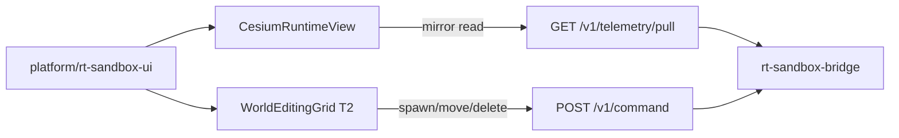

# RT-T3 — Cesium Runtime Visualization (PLAT-RT-T3)

**Phase:** PLAT-RT-T3 — RT-only Cesium 3D runtime visualization (expansion wave)  
**Prerequisite:** PLAT-RT-T2 frozen  
**Authority:** [rt_roadmap_post_g5_v1.md](../evaluation/rt_roadmap_post_g5_v1.md); [rt_cesium_runtime_ui_v1.md](../evaluation/rt_cesium_runtime_ui_v1.md); [rt_bridge_contract_v1.md](../evaluation/rt_bridge_contract_v1.md)

## Goal

Add an **RT-only Cesium runtime visualization surface** on top of frozen PLAT-RT-T1/T2. Globe/scene, entity markers, world bounds overlay, session-scoped cognition — preserving pull-only telemetry, SVG world editing, governance banners, and strict SA isolation.

## Architecture



## Allowed

| Item | Location / notes |
|------|------------------|
| Cesium runtime view | `platform/rt-sandbox-ui/src/cesium/` |
| Entity markers from pull mirror | `entity_pose_mirror` channel |
| World bounds overlay | ±500 m ENU, fictional georef anchor |
| Fifth banner | `CESIUM RUNTIME VIEW` when connected |
| Cesium cognition helpers | `src/cesium/cognition.ts` |
| Camera helpers / viz toggles | Local inspect only; no bridge |
| RT-fixed fictional georef | Display-only; not operational geography |
| Tests | Vitest coordinates/cognition + isolation extension |
| T2 SVG editor | Retained for interactive editing |

## Forbidden

- Any edits to `platform/sa-r0-viewer/`
- SA replay ingestion; federation/corpus writes
- New bridge commands or telemetry channels
- WebSocket / push telemetry
- Browser→ROS direct; rosbridge; legacy `web/` for RT
- Cesium Ion / operational terrain authority
- Hidden persistence (localStorage, file writes)
- Multi-session UI; tactical/HITL/ops-dashboard semantics
- Removing T2 SVG world editor

## Validation

```bash
python3 scripts/rt/lint_rt_runtime_subcommands.py --check
python3 -m pytest src/counter_uas/test/test_rt_sandbox_bridge.py -q
(cd platform/rt-sandbox-ui && npm ci && npm test && npm run build)
scripts/ci_eval.sh tier0
scripts/ci_eval.sh tier0-rt-ui
```

## Stop line

PLAT-RT-T3 frozen. Do not start **PLAT RT→SA bridge implementation**, federation hooks, or RT-T4 without explicit new wave audit.

## Related

- [rt_t3_governance_review_r1.md](../evaluation/rt_t3_governance_review_r1.md)
- [rt_t3_freeze_audit.md](../evaluation/rt_t3_freeze_audit.md)
- [rt_t2_world_editing_ui_plan.md](rt_t2_world_editing_ui_plan.md) (T2 baseline)
