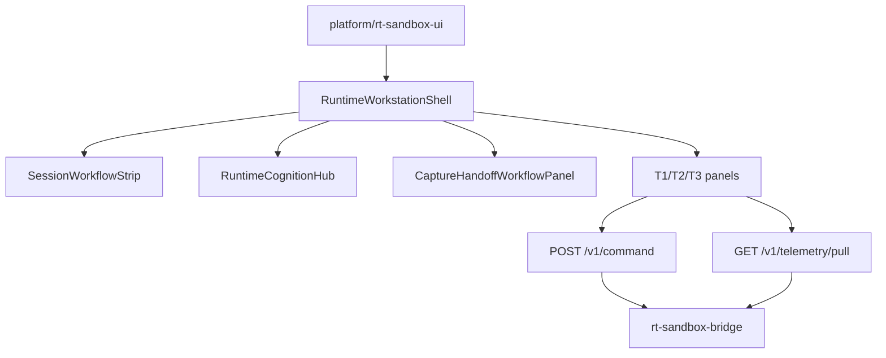

# RT-T4 — Runtime Session Workspace UX Polish (PLAT-RT-T4)

**Phase:** PLAT-RT-T4 — RT-only runtime workstation layout and workflow visibility (expansion wave)  
**Prerequisite:** PLAT-RT-T3 and PLAT-RT-SA1 frozen  
**Authority:** [rt_roadmap_post_g5_v1.md](../evaluation/rt_roadmap_post_g5_v1.md); [rt_runtime_workstation_ui_v1.md](../evaluation/rt_runtime_workstation_ui_v1.md); [rt_bridge_contract_v1.md](../evaluation/rt_bridge_contract_v1.md)

## Goal

Polish the RT sandbox browser surface into a **segmented runtime workstation**: clearer panel hierarchy, session workflow badges, consolidated runtime cognition, and read-only capture/handoff pipeline guidance — preserving pull-only telemetry, T1–T3 capabilities, governance banners, and strict SA isolation.

## Architecture



## Allowed

| Item | Location / notes |
|------|------------------|
| Workstation shell | `platform/rt-sandbox-ui/src/workstation/` |
| Session workflow strip | Connection, lifecycle, paused, editing, pull fault badges |
| Runtime cognition hub | Consolidated authority/source/health from pull channels |
| Capture/handoff panel | Lifecycle-derived capture readiness + maintainer CLI workflow map |
| Layout refactor | `App.tsx`, `useRtSession` hook, `PanelShell` consistency |
| Governance chrome polish | Banner readability; no new global banner strings |
| Disconnected idle UX | Collapsed mirrors; connect placeholder |
| Tests | Vitest workflow/cognition + pytest isolation extension |
| Docs | Contract, governance review, freeze audit |

## Forbidden

- Any edits to `platform/sa-r0-viewer/`
- New bridge commands, channels, or HTTP endpoints
- Browser `capture_session`, `rt_sa_import`, or staging filesystem reads
- SA replay ingestion; federation/corpus writes; auto-import UI
- WebSocket / push telemetry
- Browser→ROS direct; rosbridge; legacy `web/` for RT
- Hidden persistence (localStorage, file writes)
- Multi-session UI; tactical/HITL/ops-dashboard semantics
- Removing T1 telemetry panels, T2 SVG editor, or T3 Cesium mirror

## Validation

```bash
python3 scripts/rt/lint_rt_runtime_subcommands.py --check
python3 -m pytest src/counter_uas/test/test_rt_sandbox_bridge.py -q
(cd platform/rt-sandbox-ui && npm ci && npm test && npm run build)
scripts/ci_eval.sh tier0
scripts/ci_eval.sh tier0-rt-ui
```

## Stop line

PLAT-RT-T4 frozen. Do not start multi-session UI, richer RT visualization expansion, deeper SA workflow integration, or bridge staging status APIs without explicit new wave audit.

## Related

- [rt_t4_governance_review_r1.md](../evaluation/rt_t4_governance_review_r1.md)
- [rt_t4_freeze_audit.md](../evaluation/rt_t4_freeze_audit.md)
- [rt_t3_cesium_runtime_visualization_plan.md](rt_t3_cesium_runtime_visualization_plan.md) (T3 baseline)
