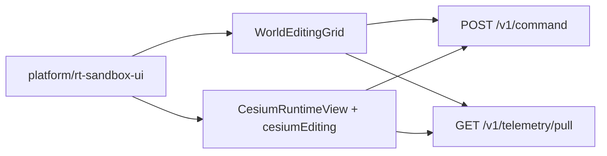

# RT-T5 — Cesium Interactive Editing (PLAT-RT-T5)

**Phase:** PLAT-RT-T5 — RT-only interactive Cesium entity editing (expansion wave)  
**Prerequisite:** PLAT-RT-T4 frozen  
**Authority:** [rt_roadmap_post_g5_v1.md](../evaluation/rt_roadmap_post_g5_v1.md); [rt_cesium_interactive_editing_ui_v1.md](../evaluation/rt_cesium_interactive_editing_ui_v1.md); [rt_bridge_contract_v1.md](../evaluation/rt_bridge_contract_v1.md)

## Goal

Make the Cesium runtime globe an **interactive editor** alongside the frozen T2 SVG grid: click-to-spawn, select, drag-to-move, and delete via existing RT-S3 entity commands — preserving pull-only telemetry, governance banners, bounds/caps, and strict SA isolation.

## Architecture



## Allowed

| Item | Location / notes |
|------|------------------|
| Cesium edit handlers | `src/cesium/cesiumEditing.ts`, `entityId.ts` |
| Camera helpers | `src/cesium/cameraHelpers.ts` — reset, focus, follow |
| Sixth banner | `INTERACTIVE EDITING` when connected |
| Cesium editing cognition | `CesiumEditingCognitionStrip`, `cesium/cognition.ts` |
| Shared App command pipeline | Same `spawn_entity` / `move_entity` / `delete_entity` as SVG |
| Dual-surface copy | SVG + Cesium co-edit same session |
| Tests | Vitest + pytest isolation extension |

## Forbidden

- Any edits to `platform/sa-r0-viewer/`
- New bridge commands or telemetry channels
- SA replay ingestion; federation/corpus writes
- WebSocket / push telemetry
- Browser→ROS direct; rosbridge; legacy `web/` for RT
- Hidden persistence (localStorage, file writes)
- Multi-session UI; tactical/HITL/ops-dashboard semantics
- Removing T2 SVG editor |

## Validation

```bash
python3 scripts/rt/lint_rt_runtime_subcommands.py --check
python3 -m pytest src/counter_uas/test/test_rt_sandbox_bridge.py -q
(cd platform/rt-sandbox-ui && npm ci && npm test && npm run build)
scripts/ci_eval.sh tier0
scripts/ci_eval.sh tier0-rt-ui
```

## Stop line

PLAT-RT-T5 frozen. Do not start RT-G6 visual fidelity expansion, multi-session UI, or bridge expansion without explicit new wave audit.

## Related

- [rt_t5_governance_review_r1.md](../evaluation/rt_t5_governance_review_r1.md)
- [rt_t5_freeze_audit.md](../evaluation/rt_t5_freeze_audit.md)
- [rt_t3_cesium_runtime_visualization_plan.md](rt_t3_cesium_runtime_visualization_plan.md) (T3 baseline)
