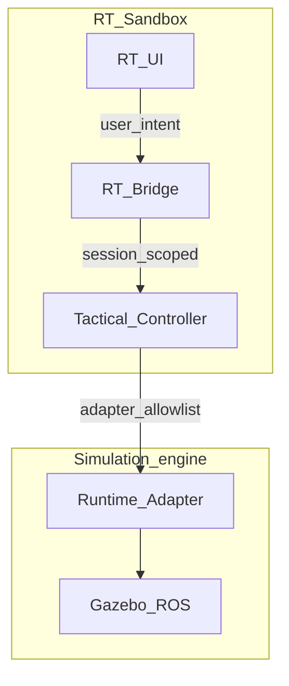

# RT-TAC1 — Tactical Controller Architecture (PLAN-RT-TAC1)

**Phase:** PLAN-RT-TAC1 — tactical controller architecture plan  
**Prerequisite:** PLAT-RT-M2, PLAT-RT-V1, PLAT-RT-SA2, PLAT-RT-T5, PLAT-RT-G6, PLAT-RT-R3d frozen  
**Build recommendation:** plan-only documentation — **no implementation**  
**Authority:** [AGENTS.md](../../AGENTS.md) remains primary governance. Frozen PLAT-RT-* behavior is unchanged except **additive** TAC1 supplements.

**Companion artifacts:**

- [rt_tac1_tactical_modes_v1.md](../evaluation/rt_tac1_tactical_modes_v1.md)
- [rt_tac1_tactical_controller_layers_v1.md](../evaluation/rt_tac1_tactical_controller_layers_v1.md)
- [rt_tac1_tactical_logic_reuse_v1.md](../evaluation/rt_tac1_tactical_logic_reuse_v1.md)
- [rt_tac1_tactical_governance_v1.md](../evaluation/rt_tac1_tactical_governance_v1.md)
- [rt_tac1_tactical_telemetry_v1.md](../evaluation/rt_tac1_tactical_telemetry_v1.md)
- [rt_tac1_tactical_capture_continuity_v1.md](../evaluation/rt_tac1_tactical_capture_continuity_v1.md)
- [rt_roadmap_tac1_tac5_v1.md](../evaluation/rt_roadmap_tac1_tac5_v1.md)
- [rt_tac1_governance_review_r1.md](../evaluation/rt_tac1_governance_review_r1.md)
- [rt_tac1_architecture_review_r1.md](../evaluation/rt_tac1_architecture_review_r1.md)
- [rt_tac1_freeze_audit.md](../evaluation/rt_tac1_freeze_audit.md)

---

## 1. Purpose and scope

### 1.1 Purpose

Define a **governance-safe architecture** for an RT sandbox **tactical controller** — candidate selection, assignment recommendations, and future autonomous simulation loops — **without** contaminating the frozen SA replay platform, **without** operational C2 semantics, and **without** runtime implementation in this wave.

PLAN-RT-TAC1 is **architecture and contracts only**. It constrains future implementation (PLAT-RT-TAC2 through TAC5) and preserves SA freeze discipline.

### 1.2 Vocabulary (mandatory)

| Term | Meaning |
|------|---------|
| **Tactical controller** | RT-local logical module between bridge dispatch and runtime adapter — sandbox selection/assignment policy only |
| **Candidate** | Sandbox entity (e.g. `interceptor`, `drone`) under review for assignment — not an operational target designation |
| **Recommendation** | Explanatory controller output in Assisted mode — requires user approval before bridge applies motion intent |
| **Sandbox assignment** | RT session commit of `assigned_candidate_id` — not weapon release or engage authority |
| **RT interactive sandbox** | PLAT-RT-S* transient Browser → Bridge → ROS2/Gazebo workflows |
| **SA sandbox workstation** | Replay-first **read-only** UX (PLAN-SA-H1–H5, frozen) |
| **Engine tactical stack** | Counter-UAS `interception_logic_node` / `guidance_lib` when launched in Gazebo — reference only for TAC1 |

Never use “sandbox” alone without **SA** or **RT** qualifier.

### 1.3 Platform identity context

**Current state (frozen):** multi-session RT sandbox (cap=3), SVG + Cesium editing, Gazebo runtime sync, telemetry UI, capture + normalization, RT→SA manual bridge, visualization fidelity. The `interceptor` entity type is a **movable sandbox actor** — not engage/intercept command semantics ([rt_bridge_contract_v1.md](../evaluation/rt_bridge_contract_v1.md)).

**TAC1 change:** authorize **tactical controller planning only** — no bridge commands, handlers, UI controls, or execution code.

### 1.4 In scope (PLAN-RT-TAC1)

| In scope | Out of scope |
|----------|--------------|
| Tactical modes (Manual / Assisted / Autonomous) | Runtime implementation |
| Layer architecture (UI → Bridge → Controller → Adapter → Gazebo) | Automatic intercept behavior |
| Logic reuse map (TTI, solver, lock, feasibility) | SA viewer integration |
| Governance protections + deny-by-default tactical commands | Federation / distributed autonomy |
| Future tactical telemetry surfaces (docs) | Parser/topic/schema changes |
| TAC5 capture continuity preview | Operational C2 / HITL workflows |
| Roadmap TAC1→TAC5 | Bridge allow-list extension |

---

## 2. Current baseline

Today's RT sandbox has **no tactical controller**:

| Layer | Tactical state today |
|-------|---------------------|
| RT UI | Entity palette includes `interceptor`; no mode selector, no assignment panel |
| RT Bridge | Entity spawn/move/delete only; `engage`/`intercept`/`strike` → `COMMAND_FORBIDDEN` |
| Tactical controller | **Does not exist** |
| Runtime adapter | Pose sync + telemetry mirrors — no selection policy |
| Gazebo / ROS | May run `interception_logic_node` independently — not wired as RT tactical authority |

Reference algorithms exist in `src/gazebo_target_sim/` for **read-only reuse planning** — see [rt_tac1_tactical_logic_reuse_v1.md](../evaluation/rt_tac1_tactical_logic_reuse_v1.md).

---

## 3. Tactical modes

See [rt_tac1_tactical_modes_v1.md](../evaluation/rt_tac1_tactical_modes_v1.md).

| Mode | Authority summary |
|------|-------------------|
| **Manual** | User commands authoritative; controller inactive or diagnostics-only |
| **Assisted** | Recommendations explanatory; **user approval** authoritative |
| **Autonomous** | Tactical controller authoritative within sandbox session caps; user may revert to Manual |

Default at session start: **Manual**.

---

## 4. Layer architecture

See [rt_tac1_tactical_controller_layers_v1.md](../evaluation/rt_tac1_tactical_controller_layers_v1.md).

Insertion point: tactical controller **behind** bridge command dispatch, **in front of** runtime adapter. Per-session tactical state — no cross-session assignment ([rt_multi_session_governance_v1.md](../evaluation/rt_multi_session_governance_v1.md)).

---

## 5. Tactical logic reuse

See [rt_tac1_tactical_logic_reuse_v1.md](../evaluation/rt_tac1_tactical_logic_reuse_v1.md).

| Concern | Repo reference | RT rule (future PLAT) |
|---------|----------------|----------------------|
| Intercept solver | `guidance_lib.solve_intercept_time` | Pure-function reuse; no parser fields |
| TTI ranking | `interception_logic_node` selection paths | TTI at `interceptor_max_speed` for consistency |
| Switch hysteresis | `selection_margin_s`, `switch_window_s` | Sandbox stability; explanatory audit |
| Assignment lock | 1.5s post-commit | Must not override Assisted approval |
| Feasibility | `FeasibilityDecision`, `_tti_feasible` | Explanatory telemetry only |
| `[TACTICAL_*]` logs | `_obs_line` in engine node | Explanatory only; RT mirrors are separate |

---

## 6. Governance protections

See [rt_tac1_tactical_governance_v1.md](../evaluation/rt_tac1_tactical_governance_v1.md).

| Protection | Rule |
|------------|------|
| Deny-by-default | All tactical bridge verbs forbidden until PLAT-RT-TAC2+ |
| No SA contamination | No viewer hooks, auto-import, federation writes |
| Lexicon | Sandbox terms: suggest, recommend, assign candidate, simulate, review |
| RT-only scope | Local loopback, single bridge, cap=3 sessions |
| Mirrors ≠ authority | Recommendations and engine logs never override registry without mode rules |

---

## 7. Tactical telemetry (future)

See [rt_tac1_tactical_telemetry_v1.md](../evaluation/rt_tac1_tactical_telemetry_v1.md).

Planned surfaces: `selected_candidate_id`, `assigned_candidate_id`, `tti_s`, `tactical_health`, `assignment_lock_active`, `tactical_mode` — all with `governance_banner` and authority labels. **No subscription or handler changes in TAC1.**

---

## 8. Capture continuity (TAC5 preview)

See [rt_tac1_tactical_capture_continuity_v1.md](../evaluation/rt_tac1_tactical_capture_continuity_v1.md).

PLAT-RT-TAC5 will preserve: selected-id timeline, assignment commits, TTI samples, mode switches, lock events — `replay_boundary_scoped`, not SA authority until maintainer import.

---

## 9. Allowed / forbidden (PLAN-RT-TAC1 wave)

### Allowed

- Documentation under `docs/platform/` and `docs/evaluation/rt_tac1_*`, `rt_roadmap_tac1_tac5_v1.md`
- Additive sections to `rt_bridge_contract_v1.md`, `rt_authority_model_v1.md`, `rt_audit_event_vocabulary_v1.md`
- PLAN-RT-TAC1 registry row + AGENTS pointer
- Governance + architecture reviews + freeze audit

### Forbidden

- `platform/rt-sandbox-bridge/` code changes
- `platform/rt-sandbox-ui/` code changes
- `platform/sa-r0-viewer/` changes
- New bridge commands, runtime handlers, UI controls
- Parser/topic/schema changes
- SA viewer integration / automatic replay ingestion
- Federation / distributed multi-bridge tactical coordination
- Operational C2 / HITL / weapon-release vocabulary

---

## 10. Validation and stop line

| Check | Method |
|-------|--------|
| Governance review | [rt_tac1_governance_review_r1.md](../evaluation/rt_tac1_governance_review_r1.md) |
| Architecture review | [rt_tac1_architecture_review_r1.md](../evaluation/rt_tac1_architecture_review_r1.md) |
| RT↔SA boundary review | Governance review §5 |
| No SA contamination | SA viewer/orchestration unchanged |
| Zero platform diff | Freeze audit regression evidence |

**Stop line:** End PLAN-RT-TAC1 after freeze audit. **Do not** start PLAT-RT-TAC2 implementation.

---

## 11. PLAT-RT-TAC2 implementation prerequisites (document only)

Bridge (future — manual mode only):

1. Extend allow-list with documented tactical verbs from [rt_tac1_tactical_governance_v1.md](../evaluation/rt_tac1_tactical_governance_v1.md) §3
2. Per-session `tactical_mode` on `SessionRecord` (default `manual`)
3. Tactical controller module stub behind dispatch — user-authoritative assign/select
4. No Assisted auto-apply; no Autonomous loop
5. Integration tests: deny-by-default for undeclared verbs; manual assign does not cross sessions

UI (future):

1. Mode selector (Manual only enabled in TAC2)
2. Candidate review panel — “assign candidate”, “select for review” copy
3. Governance banners per [rt_tac1_tactical_telemetry_v1.md](../evaluation/rt_tac1_tactical_telemetry_v1.md)

Logic (future):

1. Vendored or imported `guidance_lib` pure functions — golden tests from `test_intercept_solver_golden.py`
2. RT tactical mirrors — not raw `[TACTICAL_*]` log dependence

---

## 12. Related (frozen)

- [rt_bridge_contract_v1.md](../evaluation/rt_bridge_contract_v1.md)
- [rt_authority_model_v1.md](../evaluation/rt_authority_model_v1.md)
- [rt_runtime_governance_v1.md](../evaluation/rt_runtime_governance_v1.md)
- [rt_sa_export_boundary_v1.md](../evaluation/rt_sa_export_boundary_v1.md)
- [rt_capture_continuity_v1.md](../evaluation/rt_capture_continuity_v1.md)
- [rt_multi_session_governance_v1.md](../evaluation/rt_multi_session_governance_v1.md)
- [reviewer_interpretation_guide.md](../evaluation/reviewer_interpretation_guide.md)
- [freeze_registry_r1.md](../evaluation/freeze_registry_r1.md)
