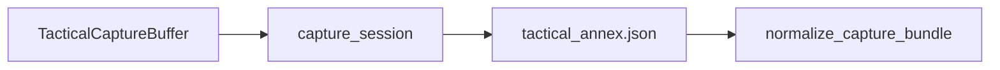

# RT-TAC5 — Tactical Capture Continuity (PLAT-RT-TAC5)

**Phase:** PLAT-RT-TAC5 — tactical capture annex  
**Prerequisite:** PLAT-RT-TAC4 frozen  
**Authority:** [rt_tac1_tactical_capture_continuity_v1.md](../evaluation/rt_tac1_tactical_capture_continuity_v1.md); [AGENTS.md](../../AGENTS.md)

**Companion artifacts:**

- [rt_tac5_governance_review_r1.md](../evaluation/rt_tac5_governance_review_r1.md)
- [rt_tac5_freeze_audit.md](../evaluation/rt_tac5_freeze_audit.md)

---

## 1. Purpose

Persist sandbox tactical continuity from runtime into capture artifacts: `rt_tactical_capture_annex_v1` embedded in normalized capture, with staging sidecar `tactical_annex.json`, provenance refs, and capture-time audits.

---

## 2. Architecture

Buffer records timelines during tactical commands; `capture_session` freezes buffer into annex before normalization.

---

## 3. Allowed

| Item | Notes |
|------|-------|
| `tactical_capture_buffer.py` | Session-scoped bounded timelines |
| `tactical_capture_annex.py` | Annex builder + capture audits |
| `tactical_annex` on `rt_normalized_capture_v1` | Optional; `replay_boundary_scoped` |
| Capture audits | `tactical_capture_annex_written` / `_empty` + rollup events |
| `rt_capture_inspect tactical-continuity` | Maintainer read-only |
| `has_tactical_annex` on handoff row | Read-only mirror flag |

## 4. Forbidden

- SA viewer changes; automatic SA import; federation writes
- Parser/topic changes; new bridge commands
- Tactical runtime redesign; distributed multi-bridge

---

## 5. Stop line

No PLAT-RT-SA3 or RT-V2 without explicit new wave audit.
