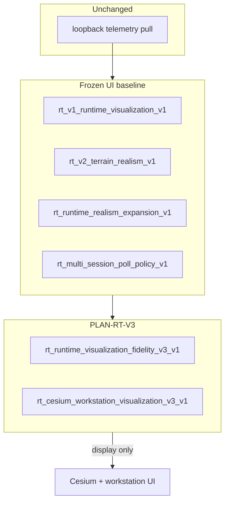

# RT-V3 — Runtime Visualization Fidelity (PLAN-RT-V3)

**Phase:** PLAN-RT-V3 — runtime visualization fidelity planning (docs only)  
**Prerequisite:** PLAN-RT-C2 frozen; PLAT-RT-V1, PLAT-RT-V2, PLAT-RT-F4, PLAT-RT-M3 frozen  
**Contracts:** [rt_runtime_visualization_fidelity_v3_v1.md](../evaluation/rt_runtime_visualization_fidelity_v3_v1.md), [rt_cesium_workstation_visualization_v3_v1.md](../evaluation/rt_cesium_workstation_visualization_v3_v1.md)  
**Baseline:** [rt_c2_platform_consolidation_freeze_audit.md](../evaluation/rt_c2_platform_consolidation_freeze_audit.md), [rt_roadmap_next_frontiers_v4.md](../evaluation/rt_roadmap_next_frontiers_v4.md)

## Vocabulary (critical)

| Label | Meaning |
|-------|---------|
| **PLAN-RT-V3** (this wave) | Visualization fidelity **planning** — documentation only |
| **PLAT-RT-V3** | UI implementation backlog — **not authorized** by PLAN |
| **PLAN-RT-F4** / **PLAT-RT-F4** | Contour/LOS realism — V3 builds on, does not replace |
| **PLAT-RT-F5b** | Fidelity truth coupling — separate authority semantics; V3 references labels only |
| **Registry RT-1..7** | Simulation realism waves — **not** RT-Sandbox V* |

Artifact prefix: `rt_v3_*` (avoid collision with `rt_roadmap_next_frontiers_v3.md`).

## Goal

Define the next **visualization fidelity** layer after frozen V1/V2/F4: unified visual layer registry, richer environment readability, runtime visibility overlays, grouped sensor/occlusion cognition, Cesium/workstation layout extensions, multi-session globe readability, and background diagnostic visibility — **without** bridge/runtime implementation, SA viewer changes, tactical redesign, auto-import, or distributed multi-bridge.

## Architecture



| Layer | Role |
|-------|------|
| Frozen V1/V2/F4 | Markers, terrain, contours/LOS — authority unchanged |
| V3 layer registry | Canonical `layer_id`, z-order, defaults, performance budget |
| V3 workstation annex | Panel zones, cognition grouping, multi-session chrome, diagnostic visibility |
| F5b (reference) | `truth_attested` vs `explanatory` labels — not redefined by V3 |

## Workstreams

| # | Workstream | Primary artifact |
|---|------------|------------------|
| 1 | Runtime visualization fidelity | [rt_runtime_visualization_fidelity_v3_v1.md](../evaluation/rt_runtime_visualization_fidelity_v3_v1.md) |
| 2 | Cesium / workstation visualization | [rt_cesium_workstation_visualization_v3_v1.md](../evaluation/rt_cesium_workstation_visualization_v3_v1.md) |
| 3 | Architecture + governance + realism | Reviews + freeze audit |
| 4 | PLAT backlog + frontier v5 | [rt_roadmap_plat_rt_v3_v1.md](../evaluation/rt_roadmap_plat_rt_v3_v1.md), [rt_roadmap_next_frontiers_v5.md](../evaluation/rt_roadmap_next_frontiers_v5.md) |

## Deliverables

| Artifact | Path |
|----------|------|
| Runtime visualization contract | [rt_runtime_visualization_fidelity_v3_v1.md](../evaluation/rt_runtime_visualization_fidelity_v3_v1.md) |
| Cesium/workstation contract | [rt_cesium_workstation_visualization_v3_v1.md](../evaluation/rt_cesium_workstation_visualization_v3_v1.md) |
| Architecture review | [rt_v3_architecture_review_r1.md](../evaluation/rt_v3_architecture_review_r1.md) |
| Governance review | [rt_v3_governance_review_r1.md](../evaluation/rt_v3_governance_review_r1.md) |
| Visualization realism review | [rt_v3_visualization_realism_review_r1.md](../evaluation/rt_v3_visualization_realism_review_r1.md) |
| PLAT roadmap | [rt_roadmap_plat_rt_v3_v1.md](../evaluation/rt_roadmap_plat_rt_v3_v1.md) |
| Next frontiers v5 | [rt_roadmap_next_frontiers_v5.md](../evaluation/rt_roadmap_next_frontiers_v5.md) |
| Freeze audit | [rt_v3_freeze_audit.md](../evaluation/rt_v3_freeze_audit.md) |

## Allowed (PLAN wave)

- Master plan, two contracts, three reviews, roadmaps, freeze audit
- Optional reference fixture: [fixtures/rt_visualization/v3_layer_registry_example.json](../../fixtures/rt_visualization/v3_layer_registry_example.json)
- [freeze_registry_r1.md](../evaluation/freeze_registry_r1.md) + [AGENTS.md](../../AGENTS.md)

## Forbidden

- Implementation under `platform/rt-sandbox-bridge/`, `platform/rt-sandbox-ui/`, `platform/sa-r0-viewer/`, `src/counter_uas/` (except optional JSON fixture)
- Bridge API / telemetry / subcommand registry changes
- Parser/topic/schema changes; tactical authority changes
- SA viewer changes; auto-import; federation writes from RT
- Browser `capture_session`, import, or subprocess pipeline from UI
- Distributed multi-bridge; Cesium Ion; Gazebo terrain physics
- Re-opening V1/V2/F4 default-on layers or F5b coupling semantics

## PLAT-RT-V3 scope (advisory — not authorized by PLAN)

See [rt_roadmap_plat_rt_v3_v1.md](../evaluation/rt_roadmap_plat_rt_v3_v1.md):

- **P0:** Layer registry module + fixture + vitest contract tests + toggle wiring
- **P1:** Visibility overlay pack + cognition strip grouping + Cesium polish
- **P2:** Workstation layout zones + multi-session globe chrome + diagnostic visibility

## Validation

Docs-only wave — cite existing suites in freeze audit:

```bash
python3 scripts/rt/lint_rt_runtime_subcommands.py --check
python3 -m pytest src/counter_uas/test/test_rt_sandbox_bridge.py -q
cd platform/rt-sandbox-ui && npm test && npm run build
scripts/ci_eval.sh tier0-rt-ui
```

## Stop line

**PLAN-RT-V3** freezes visualization fidelity planning. Do not start **PLAT-RT-V3** without implementation plan + governance review + freeze audit per phase.

Recommended next step is **advisory only** — see [rt_roadmap_next_frontiers_v5.md](../evaluation/rt_roadmap_next_frontiers_v5.md) §6.

## Related

- [rt_v3_architecture_review_r1.md](../evaluation/rt_v3_architecture_review_r1.md)
- [rt_v3_governance_review_r1.md](../evaluation/rt_v3_governance_review_r1.md)
- [rt_v3_visualization_realism_review_r1.md](../evaluation/rt_v3_visualization_realism_review_r1.md)
- [rt_v3_freeze_audit.md](../evaluation/rt_v3_freeze_audit.md)
