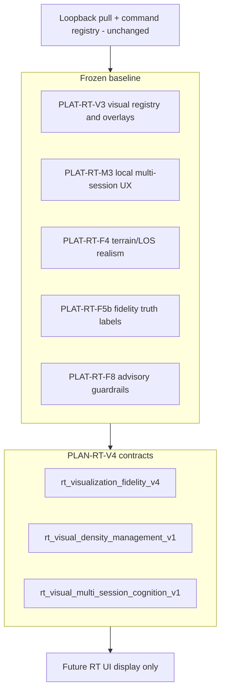

# RT-V4 - Visualization Fidelity (PLAN-RT-V4)

**Phase:** PLAN-RT-V4 - visualization fidelity planning (docs only)  
**Prerequisite:** PLAT-RT-V3, PLAT-RT-F8, PLAT-RT-M3, PLAT-RT-X2, PLAN-RT-C3 frozen  
**Contracts:** [rt_visualization_fidelity_v4.md](../evaluation/rt_visualization_fidelity_v4.md), [rt_visual_density_management_v1.md](../evaluation/rt_visual_density_management_v1.md), [rt_visual_multi_session_cognition_v1.md](../evaluation/rt_visual_multi_session_cognition_v1.md)  
**Baseline:** [rt_plat_v3_p2_freeze_audit.md](../evaluation/rt_plat_v3_p2_freeze_audit.md), [rt_plat_f8_p2_freeze_audit.md](../evaluation/rt_plat_f8_p2_freeze_audit.md), [rt_c3_platform_consolidation_freeze_audit.md](../evaluation/rt_c3_platform_consolidation_freeze_audit.md)

## Vocabulary

| Label | Meaning |
|-------|---------|
| **PLAN-RT-V4** (this wave) | Visualization fidelity planning - documentation only |
| **PLAT-RT-V4** | Future implementation backlog - not authorized by PLAN |
| **PLAN-RT-X3** | Candidate experiment workbench planning - separate frontier |
| **Checkpoint review** | Future post-V4 or post-X3 consolidation review - no implementation |
| **Explanatory visual** | Display/cognition cue only; not command, registry, import, or replay authority |

Artifact prefix: `rt_v4_*` for reviews/freeze and `rt_visual_*_v1` for contracts.

## Goal

Define the fourth RT visualization layer after frozen V3: richer multi-session visualization, advanced visibility and terrain cognition, visual density management, session comparison visuals, Cesium/workstation ergonomics, layer-density strategy, and background diagnostic visual cohesion - without runtime implementation, bridge changes, Cesium code changes, SA viewer changes, import semantics, federation writes, or browser authority.

## Architecture



| Layer | PLAN-RT-V4 role |
|-------|-----------------|
| V3 visual registry | Preserve registry semantics; plan additive grouping/density extensions only |
| V4 fidelity contract | Advanced terrain/visibility cognition and comparison visuals |
| Density contract | Layer priority, declutter, legends, and performance budget rules |
| Multi-session cognition contract | Active/background/session-compare visuals for local cap=3 sessions |
| Governance reviews | Re-confirm explanatory != authority, no SA contamination, no browser->ROS |

## Required workstreams

| # | Workstream | Primary artifact |
|---|------------|------------------|
| 1 | Visualization fidelity v4 | [rt_visualization_fidelity_v4.md](../evaluation/rt_visualization_fidelity_v4.md) |
| 2 | Visual density management | [rt_visual_density_management_v1.md](../evaluation/rt_visual_density_management_v1.md) |
| 3 | Multi-session visual cognition | [rt_visual_multi_session_cognition_v1.md](../evaluation/rt_visual_multi_session_cognition_v1.md) |
| 4 | Reviews + freeze | Architecture, governance, realism reviews; freeze audit |
| 5 | Roadmap reset | [rt_roadmap_plat_rt_v4_v1.md](../evaluation/rt_roadmap_plat_rt_v4_v1.md), [rt_roadmap_next_frontiers_v9.md](../evaluation/rt_roadmap_next_frontiers_v9.md) |

## Deliverables

| Artifact | Path |
|----------|------|
| Master plan | [rt_v4_visualization_fidelity_plan.md](rt_v4_visualization_fidelity_plan.md) |
| Visualization fidelity contract | [rt_visualization_fidelity_v4.md](../evaluation/rt_visualization_fidelity_v4.md) |
| Density management contract | [rt_visual_density_management_v1.md](../evaluation/rt_visual_density_management_v1.md) |
| Multi-session cognition contract | [rt_visual_multi_session_cognition_v1.md](../evaluation/rt_visual_multi_session_cognition_v1.md) |
| Architecture review | [rt_v4_architecture_review_r1.md](../evaluation/rt_v4_architecture_review_r1.md) |
| Governance review | [rt_v4_governance_review_r1.md](../evaluation/rt_v4_governance_review_r1.md) |
| Visualization realism review | [rt_v4_visualization_realism_review_r1.md](../evaluation/rt_v4_visualization_realism_review_r1.md) |
| PLAT roadmap | [rt_roadmap_plat_rt_v4_v1.md](../evaluation/rt_roadmap_plat_rt_v4_v1.md) |
| Next frontiers v9 | [rt_roadmap_next_frontiers_v9.md](../evaluation/rt_roadmap_next_frontiers_v9.md) |
| Freeze audit | [rt_v4_freeze_audit.md](../evaluation/rt_v4_freeze_audit.md) |

## Allowed

- Documentation under `docs/platform/` and `docs/evaluation/`
- Updates to [freeze_registry_r1.md](../evaluation/freeze_registry_r1.md) and [AGENTS.md](../../AGENTS.md)
- PLAT-RT-V4 roadmap planning only
- Explanatory visual vocabulary and future implementation anchors

## Forbidden

- Runtime implementation under `platform/rt-sandbox-ui/`, `platform/rt-sandbox-bridge/`, `src/counter_uas/`, or `platform/sa-r0-viewer/`
- Bridge API, telemetry, command registry, parser, topic, or schema changes
- Cesium code changes in this PLAN wave
- SA viewer changes, SA import semantics, auto-import, federation writes, or corpus commit actions
- Browser->ROS authority, browser capture/import pipelines, distributed runtime, or multi-bridge expansion
- Tactical redesign, operational readiness scoring, HITL/C2 semantics, or registry command truth changes

## PLAT-RT-V4 scope (advisory only)

See [rt_roadmap_plat_rt_v4_v1.md](../evaluation/rt_roadmap_plat_rt_v4_v1.md):

- **P0:** Density policy and layer budget contracts in the existing V3 registry surface
- **P1:** Advanced visibility/terrain cognition visuals, default-off and explanatory
- **P2:** Multi-session comparison visuals and background diagnostic visual cohesion

PLAN-RT-V4 does not authorize those phases.

## Validation

Docs-only wave - freeze audit must confirm:

- docs-only diff
- no runtime changes
- no bridge changes
- no Cesium code changes
- no SA changes
- no import changes
- coherent roadmap
- governance boundaries preserved

Reference regression suites for future PLAT only:

```bash
python3 scripts/rt/lint_rt_runtime_subcommands.py --check
python3 -m pytest src/counter_uas/test/test_rt_sandbox_bridge.py -q
cd platform/rt-sandbox-ui && npm test && npm run build
scripts/ci_eval.sh tier0-rt-ui
```

## Stop line

**PLAN-RT-V4** freezes visualization planning only. Do not start **PLAT-RT-V4**, **PLAN-RT-X3**, checkpoint implementation work, or any distributed runtime without a scoped wave plan, governance review, required contamination review, regression evidence, freeze audit, and freeze registry update.

## Related

- [rt_v4_architecture_review_r1.md](../evaluation/rt_v4_architecture_review_r1.md)
- [rt_v4_governance_review_r1.md](../evaluation/rt_v4_governance_review_r1.md)
- [rt_v4_visualization_realism_review_r1.md](../evaluation/rt_v4_visualization_realism_review_r1.md)
- [rt_v4_freeze_audit.md](../evaluation/rt_v4_freeze_audit.md)
