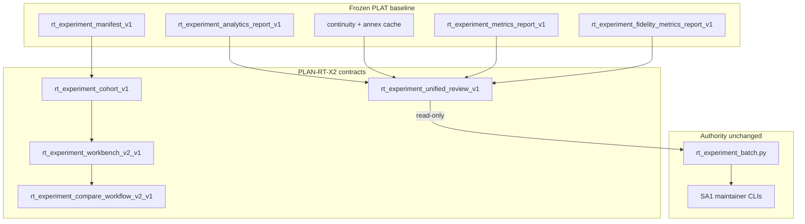

# RT-X2 — Experiment Workbench v2 (PLAN-RT-X2)

**Phase:** PLAN-RT-X2 — experiment workbench v2 planning (docs only)  
**Prerequisite:** PLAT-RT-X1, PLAT-RT-F1, PLAT-RT-F3, PLAT-RT-F5 P0–P2, PLAT-RT-F5b P0–P2 frozen; PLAT-RT-V3 complete; PLAN-RT-C2 frozen  
**Contracts:** [rt_experiment_workbench_v2_v1.md](../evaluation/rt_experiment_workbench_v2_v1.md), [rt_experiment_cohort_v1.md](../evaluation/rt_experiment_cohort_v1.md), [rt_experiment_unified_review_v1.md](../evaluation/rt_experiment_unified_review_v1.md), [rt_experiment_compare_workflow_v2_v1.md](../evaluation/rt_experiment_compare_workflow_v2_v1.md)  
**Baseline:** [rt_c2_platform_consolidation_freeze_audit.md](../evaluation/rt_c2_platform_consolidation_freeze_audit.md), [rt_roadmap_next_frontiers_v5.md](../evaluation/rt_roadmap_next_frontiers_v5.md)

## Vocabulary (critical)

| Label | Meaning |
|-------|---------|
| **PLAN-RT-X2** (this wave) | Experiment workbench v2 **planning** — documentation only |
| **PLAT-RT-X2** | UI/CLI implementation backlog — **not authorized** by PLAN |
| **PLAT-RT-X1** | Frozen compare + manifest + batch — X2 **extends ergonomics**, does not replace |
| **PLAN-RT-F5** / **PLAT-RT-F5** | Advanced experiment taxonomy — X2 unifies review flow, does not replace spec/metrics |
| **PLAN-RT-F8** | Post-F7 advisory expansion — **separate** candidate; ranked in v6 |
| **Cohort** | Advisory grouping of manifests/runs — **not** operational readiness or SA corpus authority |

Artifact prefix: `rt_x2_*` / `rt_experiment_*` (avoid collision with `rt_roadmap_next_frontiers_v2` C2 consolidation doc).

## Goal

Define experiment workbench **v2** after frozen X1 + F1/F3/F5/F5b: cohort organization, multi-manifest review, unified maintainer review lane (F1 → F3 → F5/F5b → compare), and richer compare workflow ergonomics — **without** bridge/runtime implementation, SA viewer changes, tactical redesign, auto-import, or distributed multi-bridge.

## Architecture



| Layer | Role |
|-------|------|
| X1 baseline | [rt_experiment_workbench_v1.md](../evaluation/rt_experiment_workbench_v1.md) — manifest, 2-run compare, batch |
| Cohort index | [rt_experiment_cohort_v1.md](../evaluation/rt_experiment_cohort_v1.md) — multi-manifest references |
| Workbench v2 | [rt_experiment_workbench_v2_v1.md](../evaluation/rt_experiment_workbench_v2_v1.md) — workspace zones |
| Unified review | [rt_experiment_unified_review_v1.md](../evaluation/rt_experiment_unified_review_v1.md) — F1/F3/F5/F5b lane + review packet |
| Compare v2 | [rt_experiment_compare_workflow_v2_v1.md](../evaluation/rt_experiment_compare_workflow_v2_v1.md) — modes and navigation |

**X2 vs F5 UI:** F5 [rt_experiment_advanced_ui_v1.md](../evaluation/rt_experiment_advanced_ui_v1.md) defines panels (extended compare, matrix, filters). X2 **normativizes** how a maintainer moves through cohort → reports → compare without implying new authority.

## Workstreams

| # | Workstream | Contract |
|---|------------|----------|
| 1 | Workbench workspace v2 | [rt_experiment_workbench_v2_v1.md](../evaluation/rt_experiment_workbench_v2_v1.md) |
| 2 | Cohort organization | [rt_experiment_cohort_v1.md](../evaluation/rt_experiment_cohort_v1.md) |
| 3 | Unified review flow | [rt_experiment_unified_review_v1.md](../evaluation/rt_experiment_unified_review_v1.md) |
| 4 | Compare workflow v2 | [rt_experiment_compare_workflow_v2_v1.md](../evaluation/rt_experiment_compare_workflow_v2_v1.md) |
| 5 | Governance + validation | Reviews + [rt_x2_freeze_audit.md](../evaluation/rt_x2_freeze_audit.md) |

## Deliverables

| Artifact | Path |
|----------|------|
| Workbench v2 contract | [rt_experiment_workbench_v2_v1.md](../evaluation/rt_experiment_workbench_v2_v1.md) |
| Cohort contract | [rt_experiment_cohort_v1.md](../evaluation/rt_experiment_cohort_v1.md) |
| Unified review contract | [rt_experiment_unified_review_v1.md](../evaluation/rt_experiment_unified_review_v1.md) |
| Compare workflow v2 | [rt_experiment_compare_workflow_v2_v1.md](../evaluation/rt_experiment_compare_workflow_v2_v1.md) |
| Architecture review | [rt_x2_architecture_review_r1.md](../evaluation/rt_x2_architecture_review_r1.md) |
| Governance review | [rt_x2_governance_review_r1.md](../evaluation/rt_x2_governance_review_r1.md) |
| Experiment review | [rt_x2_experiment_review_r1.md](../evaluation/rt_x2_experiment_review_r1.md) |
| PLAT roadmap | [rt_roadmap_plat_rt_x2_v1.md](../evaluation/rt_roadmap_plat_rt_x2_v1.md) |
| Next frontiers v6 | [rt_roadmap_next_frontiers_v6.md](../evaluation/rt_roadmap_next_frontiers_v6.md) |
| Freeze audit | [rt_x2_freeze_audit.md](../evaluation/rt_x2_freeze_audit.md) |
| Reference fixture | [fixtures/rt_experiments/x2_cohort_index_example.json](../../fixtures/rt_experiments/x2_cohort_index_example.json) |

## Allowed (PLAN wave)

- Master plan, four contracts, three reviews, roadmaps, freeze audit
- Reference fixture under `fixtures/rt_experiments/`
- [freeze_registry_r1.md](../evaluation/freeze_registry_r1.md) + [AGENTS.md](../../AGENTS.md)

## Forbidden

- Implementation under `platform/rt-sandbox-ui/`, `platform/rt-sandbox-bridge/`, `platform/sa-r0-viewer/`, `src/counter_uas/` (except JSON fixture)
- Bridge API / telemetry / subcommand registry changes
- Changes to frozen `rt_experiment_analytics_report_v1` or other frozen report schemas
- Parser/topic/schema changes; tactical authority changes
- SA viewer changes; **automatic import**; federation writes from RT
- Browser `capture_session`, approve, import, or subprocess batch from UI
- Distributed multi-bridge; tactical redesign
- Winner labels, readiness scores, effectiveness claims, auto-import on `import_ready` or F5 `eligible`
- Re-opening X1 manifest semantics or F5 experiment class enum

## PLAT-RT-X2 scope (advisory — not authorized by PLAN)

See [rt_roadmap_plat_rt_x2_v1.md](../evaluation/rt_roadmap_plat_rt_x2_v1.md):

- **P0:** Cohort index store + fixture parity + multi-manifest import (read-only)
- **P1:** Unified review panel — report dock + review lane wiring to existing derive helpers
- **P2:** Compare workflow v2 UX + workbench zone refactor (thin `App.tsx` integration)

## Validation

Docs-only wave — cite existing suites in freeze audit:

```bash
python3 scripts/rt/lint_rt_runtime_subcommands.py --check
python3 -m pytest src/counter_uas/test/test_rt_experiment_batch.py -q
cd platform/rt-sandbox-ui && npm ci && npm test && npm run build
scripts/ci_eval.sh tier0-rt-ui
```

## Stop line

**PLAN-RT-X2** freezes experiment workbench v2 planning. Do not start **PLAT-RT-X2** without per-phase PLAT plan + governance review + freeze audit.

## Related

- [rt_x2_architecture_review_r1.md](../evaluation/rt_x2_architecture_review_r1.md)
- [rt_x2_governance_review_r1.md](../evaluation/rt_x2_governance_review_r1.md)
- [rt_x2_experiment_review_r1.md](../evaluation/rt_x2_experiment_review_r1.md)
- [rt_x2_freeze_audit.md](../evaluation/rt_x2_freeze_audit.md)
- [rt_x1_freeze_audit.md](../evaluation/rt_x1_freeze_audit.md)
- [rt_plat_v3_p2_freeze_audit.md](../evaluation/rt_plat_v3_p2_freeze_audit.md)
