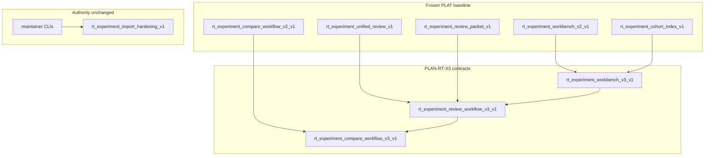

# RT-X3 — Experiment Workbench v3 (PLAN-RT-X3)

**Phase:** PLAN-RT-X3 — experiment workbench v3 planning (docs only)  
**Prerequisite:** PLAT-RT-X2 P0–P2 frozen; PLAT-RT-C4 P0–P2 frozen; PLAN-RT-X2, PLAN-RT-C4, CHECKPOINT-RT-POST-V4 frozen  
**Contracts:** [rt_experiment_workbench_v3_v1.md](../evaluation/rt_experiment_workbench_v3_v1.md), [rt_experiment_review_workflow_v3_v1.md](../evaluation/rt_experiment_review_workflow_v3_v1.md), [rt_experiment_compare_workflow_v3_v1.md](../evaluation/rt_experiment_compare_workflow_v3_v1.md)  
**Baseline:** [rt_plat_c4_p2_freeze_audit.md](../evaluation/rt_plat_c4_p2_freeze_audit.md), [rt_x2_freeze_audit.md](../evaluation/rt_x2_freeze_audit.md), [rt_roadmap_next_frontiers_v11.md](../evaluation/rt_roadmap_next_frontiers_v11.md)

## Vocabulary (critical)

| Label | Meaning |
|-------|---------|
| **PLAN-RT-X3** (this wave) | Experiment workbench v3 **planning** — documentation only |
| **PLAT-RT-X3** | UI ergonomics implementation backlog — **not authorized** by PLAN |
| **PLAN-RT-X2** / **PLAT-RT-X2** | Frozen v2 zones, cohort index, unified review, compare v2 — X3 **extends ergonomics** only |
| **PLAT-RT-C4** | Frozen behavior-neutral decomposition — X3 builds on reduced concentration |
| **Experiment cohort** | X2 `rt_experiment_cohort_index_v1` — **not** F7/F8 `readiness_cohort` / operational readiness |

Artifact prefix: `rt_x3_*` / `rt_experiment_*_v3_*`.

## Goal

Define experiment workbench **v3** ergonomics after frozen X2 + C4: richer cohort navigation, grouped review dock and packet sections, compare readability and multi-manifest drill-down — **without** bridge/runtime changes, SA viewer changes, import/capture semantic changes, tactical redesign, auto-import, or distributed multi-bridge.

## Architecture



| Layer | Role |
|-------|------|
| X2 baseline | Cohort navigator, review lane, report dock, compare stage, packet export |
| Workbench v3 | [rt_experiment_workbench_v3_v1.md](../evaluation/rt_experiment_workbench_v3_v1.md) — program context, breadcrumbs, manifest roster |
| Review workflow v3 | [rt_experiment_review_workflow_v3_v1.md](../evaluation/rt_experiment_review_workflow_v3_v1.md) — step completion, dock groups, packet `sections[]` |
| Compare workflow v3 | [rt_experiment_compare_workflow_v3_v1.md](../evaluation/rt_experiment_compare_workflow_v3_v1.md) — mode coach, status vocabulary, multi-manifest drill-down |

**X3 vs X2:** X2 normativized zones and modes; X3 normativizes **maintainer navigation and readability** without new derive math, bridge routes, or import authority.

## Workstreams

| # | Workstream | Contract |
|---|------------|----------|
| 1 | Workbench workspace v3 | [rt_experiment_workbench_v3_v1.md](../evaluation/rt_experiment_workbench_v3_v1.md) |
| 2 | Review workflow v3 | [rt_experiment_review_workflow_v3_v1.md](../evaluation/rt_experiment_review_workflow_v3_v1.md) |
| 3 | Compare workflow v3 | [rt_experiment_compare_workflow_v3_v1.md](../evaluation/rt_experiment_compare_workflow_v3_v1.md) |
| 4 | Governance + validation | Reviews + [rt_x3_freeze_audit.md](../evaluation/rt_x3_freeze_audit.md) |

## Deliverables

| Artifact | Path |
|----------|------|
| Workbench v3 contract | [rt_experiment_workbench_v3_v1.md](../evaluation/rt_experiment_workbench_v3_v1.md) |
| Review workflow v3 | [rt_experiment_review_workflow_v3_v1.md](../evaluation/rt_experiment_review_workflow_v3_v1.md) |
| Compare workflow v3 | [rt_experiment_compare_workflow_v3_v1.md](../evaluation/rt_experiment_compare_workflow_v3_v1.md) |
| Architecture review | [rt_x3_architecture_review_r1.md](../evaluation/rt_x3_architecture_review_r1.md) |
| Governance review | [rt_x3_governance_review_r1.md](../evaluation/rt_x3_governance_review_r1.md) |
| Experiment review | [rt_x3_experiment_review_r1.md](../evaluation/rt_x3_experiment_review_r1.md) |
| PLAT roadmap | [rt_roadmap_plat_rt_x3_v1.md](../evaluation/rt_roadmap_plat_rt_x3_v1.md) |
| Next frontiers v12 | [rt_roadmap_next_frontiers_v12.md](../evaluation/rt_roadmap_next_frontiers_v12.md) |
| Freeze audit | [rt_x3_freeze_audit.md](../evaluation/rt_x3_freeze_audit.md) |
| Reference fixture | [fixtures/rt_experiments/x3_review_packet_sections_example.json](../../fixtures/rt_experiments/x3_review_packet_sections_example.json) |

## Allowed (PLAN wave)

- Master plan, three contracts, three reviews, roadmaps, freeze audit
- Reference fixture under `fixtures/rt_experiments/`
- [freeze_registry_r1.md](../evaluation/freeze_registry_r1.md) + [AGENTS.md](../../AGENTS.md)

## Forbidden

- Implementation under `platform/rt-sandbox-ui/`, `platform/rt-sandbox-bridge/`, `platform/sa-r0-viewer/`, `src/counter_uas/` (except JSON fixture)
- Bridge API / telemetry / subcommand registry changes
- Changes to frozen F1/F5 report schemas or `rt_experiment_cohort_index_v1` required fields
- Changes to [rt_experiment_import_hardening_v1.md](../evaluation/rt_experiment_import_hardening_v1.md) semantics; SA import CLIs; browser capture/import
- Parser/topic/schema changes; tactical authority changes
- SA viewer changes; **automatic import**; federation writes from RT
- Browser `capture_session`, approve, import, or subprocess batch from UI
- Distributed multi-bridge; tactical redesign
- Winner labels, readiness scores, effectiveness claims, auto-import on `import_ready` or F5 `eligible`
- Merged manifest export; cross-manifest `run_id` pairing
- Re-opening X1 manifest semantics or F5 experiment class enum

## PLAT-RT-X3 scope (advisory — not authorized by PLAN)

See [rt_roadmap_plat_rt_x3_v1.md](../evaluation/rt_roadmap_plat_rt_x3_v1.md):

- **P0:** Cohort program context strip, manifest roster table, breadcrumb, tag filter, explicit secondary manifest picker
- **P1:** Review step completion UI, grouped report dock, optional packet `sections[]` export (additive on `rt_experiment_review_packet_v1`)
- **P2:** Compare mode coach, shared compare-status vocabulary, multi-manifest drill-down readability

## Validation

Docs-only wave — cite existing suites in freeze audit:

```bash
python3 scripts/rt/lint_rt_runtime_subcommands.py --check
python3 -m pytest src/counter_uas/test/test_rt_experiment_batch.py -q
cd platform/rt-sandbox-ui && npm ci && npm test && npm run build
scripts/ci_eval.sh tier0-rt-ui
```

## Stop line

**PLAN-RT-X3** freezes experiment workbench v3 planning. Do not start **PLAT-RT-X3** without per-phase PLAT plan + governance review + freeze audit (+ contamination review at P1 if F6/F7 adjacent).

## Related

- [rt_x3_architecture_review_r1.md](../evaluation/rt_x3_architecture_review_r1.md)
- [rt_x3_governance_review_r1.md](../evaluation/rt_x3_governance_review_r1.md)
- [rt_x3_experiment_review_r1.md](../evaluation/rt_x3_experiment_review_r1.md)
- [rt_x3_freeze_audit.md](../evaluation/rt_x3_freeze_audit.md)
- [rt_x2_experiment_workbench_v2_plan.md](rt_x2_experiment_workbench_v2_plan.md)
- [rt_plat_c4_p2_freeze_audit.md](../evaluation/rt_plat_c4_p2_freeze_audit.md)
