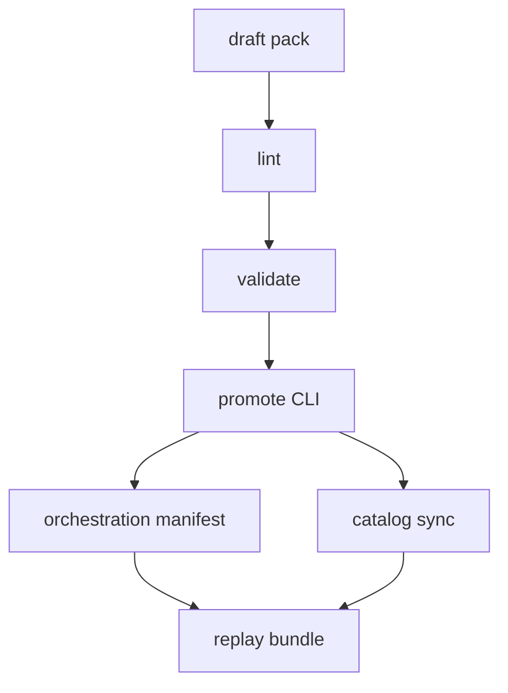
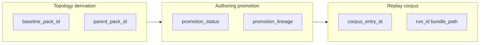

# PHASE A1 — Authoring Workstation Foundations (PLAN-SA-A1)

**Phase:** A1 — Authoring Workstation Foundations  
**Checkpoint:** `75ea6d5` (PLAT-SA-F1a–F1d + G1; PLAT-SA-H1–H5 frozen)  
**Build recommendation:** plan-only documentation — no viewer, CLI, or fixture implementation until docs frozen and review complete  
**Authority:** [AGENTS.md](../../AGENTS.md) remains primary governance. This plan extends frozen PLAT-SA-C1a/C1b, H3 orchestration, and PLAN-SA-H1 §11; it does not replace freeze audits or parser contracts.

**Companion artifacts:**

- [scenario_authoring_workflow_v1.md](../evaluation/scenario_authoring_workflow_v1.md) — draft → lint → validate → promote ladder (A1.1)
- [scenario_authoring_manifest_v1.md](../evaluation/scenario_authoring_manifest_v1.md) — additive sidecar schema (A1.2)
- [scenario_lineage_provenance_v1.md](../evaluation/scenario_lineage_provenance_v1.md) — three-plane lineage rules (A1.4)
- [authoring_workflow_continuity_v1.md](../evaluation/authoring_workflow_continuity_v1.md) — pack → orchestration → replay → viewer (A1.6)
- [sa_a1_authoring_governance_review_r1.md](../evaluation/sa_a1_authoring_governance_review_r1.md) — pre-implementation governance review
- [sa_a1_authoring_workstation_freeze_audit.md](../evaluation/sa_a1_authoring_workstation_freeze_audit.md) — docs-only freeze audit

---

## 1. Purpose and scope

### 1.1 Purpose

Define the **governance-safe authoring cognition and workflow layer** for the platform so maintainers and reviewers can understand scenario pack lineage, validation state, promotion flow, authoring provenance, pack relationships, and orchestration handoff readiness — **without** turning the browser into an execution authority.

PLAN-SA-A1 closes the documented asymmetry: replay/review/corpus/orchestration cognition is mature after H5; authoring remains procedural JSON editing without a promotion ladder or AUTHORING workstation profile (H1 §11 deferred).

### 1.2 In scope (plan deliverables)

| ID | Scope |
|----|--------|
| A1.1 | Scenario authoring workflow documentation |
| A1.2 | `scenario_authoring_manifest_v1` schema direction (additive sidecar) |
| A1.3 | CLI authoring helpers — **specified only**; implemented in PLAT-SA-A1 |
| A1.4 | Scenario lineage / provenance rules (three planes) |
| A1.5 | AUTHORING workspace profile (read-only viewer surfaces) |
| A1.6 | Workflow continuity with orchestration and replay |
| A1.7 | Validation / promotion lifecycle and freeze boundaries |
| A1.8 | Orchestration handoff boundaries |
| — | Governance review + docs-only freeze audit |

### 1.3 Out of scope (PLAN-SA-A1)

| Out of scope | Rationale |
|--------------|-----------|
| Viewer / CLI / script implementation | Requires PLAT-SA-A1 after docs freeze |
| `scenario_topology_v1` required-field changes | Parser-safe; additive sidecar only |
| Browser topology editing, drag/drop GIS | Explicit non-goal |
| Browser runtime execution, live orchestration | H3/H4 boundaries |
| HITL / operator / tactical UX | AGENTS.md forbidden |
| Corpus auto-release promotion | G1 P2 deferred; F1d gate separate |
| Runtime realism / tracker redesign | Runtime frontier only |

### 1.4 Depends on

`PLAN-SA-H1`, `PLAT-SA-H2`–`H5`, `PLAT-SA-C1a`, `PLAT-SA-C1b`, `PLAT-SA-H3`, `PLAT-SA-R0`, `PLAT-SA-F1a`–`F1d`, G1 review trio.

---

## 2. Problem statement

### 2.1 Platform asymmetry

| Mature (post-H5) | Immature (pre-A1) |
|------------------|-------------------|
| Replay bundle review, compare, sweeps | No documented promotion ladder |
| Corpus index, drift, evolution | No authoring manifest sidecar |
| Offline orchestration mirrors | No stale-validation policy |
| Publication / presentation UX | H1 AUTHORING profile not concretized |
| Workflow continuity (H4) | Authoring prefix chain undocumented |

Current maintainer path: edit topology JSON → `validate_scenario.py` → catalog browse → optional orchestration manifest — with no shared artifact for **promotion state** or **validation linkage**.

### 2.2 H1 unrealized authoring profile

[PLAN-SA-H1 §11](h1_sandbox_ux_architecture_plan.md) specifies an **Authoring workstation** profile distinct from Replay. H2–H5 implemented the five-segment shell and orchestration mirrors but left the Scenario segment banner as `SCENARIO` without full authoring cognition panels.

---

## 3. Platform identity (unchanged)

| Layer | Role |
|-------|------|
| **Web platform** | Scenario authoring + orchestration + replay/research ecosystem |
| **Gazebo / ROS 2** | Runtime simulation engine |

The viewer remains a **read-only consumer** of frozen artifacts. A1 improves how maintainers **orient, validate, promote, and hand off** fixture topology — not how simulations are commanded.

---

## 4. Goals and non-goals

### 4.1 Goals

- Document CLI-authoritative workflow: draft → lint → validate → promote → optional orchestration → replay bundle.
- Define additive `authoring_manifest.json` without changing `scenario_topology_v1` authority.
- Separate topology derivation, authoring promotion, and replay/corpus lineage planes.
- Specify read-only AUTHORING viewer profile (banner + panel registry IDs).
- Define orchestration handoff readiness without browser execution.
- Extend workflow continuity from pack through corpus to viewer segments.

### 4.2 Strict non-goals (forbidden)

| Non-goal | Category |
|----------|----------|
| Browser topology editing | UX |
| Drag/drop topology / GIS editor | UX |
| Browser runtime execution | Runtime |
| Live orchestration from browser | Orchestration |
| HITL / operator workflows | Operational |
| Tactical semantics / command console UX | Operational |
| Async workers | Infrastructure |
| rosbridge / WebSocket | Live data |
| Collaborative editing | UX |
| ML recommendations | Analytics |
| Readiness scoring | Governance |
| Parser / schema / topic redesign | Contracts |
| Game-editor or military command console UX | Identity |

---

## 5. Authoring workflow architecture (A1.1)

Authoritative detail: [scenario_authoring_workflow_v1.md](../evaluation/scenario_authoring_workflow_v1.md).



**Rule:** Viewer observes; CLI promotes.

---

## 6. Manifest and lineage contracts (A1.2, A1.4)

| Contract | Document |
|----------|----------|
| `scenario_authoring_manifest_v1` | [scenario_authoring_manifest_v1.md](../evaluation/scenario_authoring_manifest_v1.md) |
| Three lineage planes | [scenario_lineage_provenance_v1.md](../evaluation/scenario_lineage_provenance_v1.md) |

**Additive-only:** Sidecar at `fixtures/scenarios/<pack_id>/authoring_manifest.json`. Does not alter `metadata.json` required fields. Complements `metadata.provenance.baseline_pack_id` (C1b) with `parent_pack_id` and `promotion_lineage`.

---

## 7. Promotion workflow boundaries (A1.5, A1.7)

### 7.1 Promotion means

Fixture `scenario_topology_v1` pack graduates through lint and validate to **catalog-eligible** and **orchestration-referenceable** state via CLI `promote_scenario_pack.py` (PLAT-SA-A1).

### 7.2 Promotion does not mean

- Corpus release snapshot (`sa_r0_corpus_r1_r*`) — F1d maintainer gate
- Auto-publish to live URLs
- Simulation launch or Gazebo readiness
- Readiness, effectiveness, or robustness scoring
- Tracker “track promotion” or lifecycle authority

### 7.3 Stale validation

If canonical pack files change after `validation_pack_fingerprint` was recorded, `promotion_status` downgrades to `linted` or `draft` until re-validate. See workflow doc § Stale validation policy.

### 7.4 Validation / promotion lifecycle

| Status | Next maintainer step |
|--------|----------------------|
| `draft` | Lint, validate |
| `linted` | Validate |
| `validated` | Promote |
| `promoted` | Catalog sync; optional orchestration |
| `orchestration_ready` | Run queue via CLI; inspect mirrors |

---

## 8. AUTHORING workspace profile (A1.5)

Implementation deferred to **PLAT-SA-A1**. Specification only in this plan.

| Element | Specification |
|---------|----------------|
| **Segment home** | Existing `scenario` workspace segment (no sixth segment) |
| **Banner** | `AUTHORING — fixture topology only; CLI promotes; not live configuration` when authoring mirrors present; else retain `SCENARIO` banner |
| **Panel registry IDs** | `authoring.topology_inspector`, `authoring.validation_mirror`, `authoring.lineage`, `authoring.promotion_status`, `authoring.orchestration_handoff` |
| **Data sources** | Static JSON: pack mirror, `authoring_manifest.json`, H3 `validation_mirrors/`, catalog entry |
| **Composition targets** | Extend `ProvenancePanel`, `OrchestrationStatusPanel` — no GovernanceChrome redesign |

### 8.1 Forbidden in viewer

Inline edit, save, launch, regen triggers, WebSocket, mutation of `promotion_status`, calls to `run_experiment_queue.py` or `sync_sa_catalog.py`.

---

## 9. Orchestration handoff boundaries (A1.8)

| Rule | Detail |
|------|--------|
| Readiness | Jobs SHOULD reference packs with `promotion_status >= promoted` and non-stale validation mirror (PLAT-SA-A1 lint) |
| First step | `validate_scenario` remains first pipeline step per [experiment_job_manifest_v1.md](../evaluation/experiment_job_manifest_v1.md) |
| Viewer panel | `authoring.orchestration_handoff` shows manifest id, queue mirror id, validation ok/issues — links only |
| Forbidden | Browser-triggered queue run, `--allow-runtime-capture`, catalog sync |

Handoff refs stored in manifest `orchestration_handoff_refs[]` are **explanatory** only.

---

## 10. Workflow continuity (A1.6)

Full chain: [authoring_workflow_continuity_v1.md](../evaluation/authoring_workflow_continuity_v1.md).

`draft pack` → `lint` → `validate` → `promote` → `[catalog sync]` → `orchestration manifest` → `queue mirror` → `bundle` → `corpus lineage` → viewer segments (Scenario → Replay → Compare → Corpus → Report).

URL param precedence unchanged from H4. Optional PLAT-SA-A1: `?authoring_pack=<pack_id>` for Scenario segment deep link.

---

## 11. Three lineage planes



| Plane | Do not merge with |
|-------|-------------------|
| Topology derivation | Corpus release DAG |
| Authoring promotion | Parser-visible summaries |
| Replay / corpus | Topology edit authority |

Detail: [scenario_lineage_provenance_v1.md](../evaluation/scenario_lineage_provenance_v1.md).

---

## 12. Freeze boundaries and risks

### 12.1 PLAN-SA-A1 boundaries

| Boundary | Rule |
|----------|------|
| Implementation | **None** in PLAN-SA-A1 |
| Viewer / scripts | **No changes** until PLAT-SA-A1 |
| Parser / topics | **No changes** |
| `scenario_topology_v1` | Sidecar only |
| Registry | Add PLAN-SA-A1 row; do not alter frozen PLAT-SA-* rows |
| AGENTS.md | One-line pointer after docs frozen |

### 12.2 Risks

| Risk | Mitigation |
|------|------------|
| Game-editor drift | Non-goals §4.2; freeze audit |
| Authority creep | CLI-only promotion; mirror banners |
| Stale mirror trust | Fingerprint downgrade policy |
| Promotion vs corpus release confusion | §7.2 terminology |
| H3 promotion deferral overlap | A1 owns scenario-pack promotion only |

---

## 13. Deliverables checklist (plan → audit)

| # | Deliverable | Document | Frozen at PLAN |
|---|-------------|----------|----------------|
| 1 | Master plan (this file) | `sa_a1_authoring_workstation_foundations_plan.md` | Yes |
| 2 | Authoring workflow | `scenario_authoring_workflow_v1.md` | Yes |
| 3 | Manifest schema | `scenario_authoring_manifest_v1.md` | Yes |
| 4 | Lineage rules | `scenario_lineage_provenance_v1.md` | Yes |
| 5 | Workflow continuity | `authoring_workflow_continuity_v1.md` | Yes |
| 6 | Governance review | `sa_a1_authoring_governance_review_r1.md` | Yes |
| 7 | Freeze audit | `sa_a1_authoring_workstation_freeze_audit.md` | Yes |
| 8 | Registry row PLAN-SA-A1 | `freeze_registry_r1.md` | Yes |
| 9 | AGENTS.md pointer | `AGENTS.md` | Yes |

---

## 14. Validation strategy

### 14.1 PLAN-SA-A1 (documentation-only)

- Governance review verdict: proceed (see companion review)
- Cross-link integrity: all companion docs bidirectionally linked
- Optional: `python3 scripts/evaluation/governance_lint_sa.py` on existing fixtures (no new files required)

No `tier0-sa-r0` or viewer build required for doc merge.

### 14.2 PLAT-SA-A1 (future implementation)

```bash
python3 scripts/evaluation/validate_scenario.py fixtures/scenarios/
python3 -m pytest src/counter_uas/test/test_replay_sa_scenario.py -q
(cd platform/sa-r0-viewer && npm ci && npm test && npm run build)
scripts/ci_eval.sh tier0-sa-r0
python3 scripts/evaluation/governance_lint_sa.py
python3 scripts/evaluation/audit_sa_platform_integrity.py --all
```

---

## 15. PLAT-SA-A1 implementation boundary

Requires **docs frozen** PLAN-SA-A1 + new scoped wave audit (`PLAT-SA-A1`).

| ID | Deliverable | Surface |
|----|-------------|---------|
| A1.2 | Example `authoring_manifest.json` for 2–3 valley variants | `fixtures/scenarios/` |
| A1.3 | `promote_scenario_pack.py`, `lint_scenario_authoring_manifest.py`, stale check | `scripts/evaluation/` |
| A1.5 | AUTHORING banner + panels | `platform/sa-r0-viewer/src/` |
| A1.6 | `sync_authoring_mirrors.py` or extend orchestration sync | `public/demo/` mirrors |
| — | Update freeze audit to **frozen**; registry `PLAT-SA-A1` | evaluation docs |

**Forbidden in PLAT-SA-A1 without new wave:** browser editing, live ROS, parser changes, corpus auto-release, async workers.

---

## 16. Related frozen map

| Document | Role |
|----------|------|
| [scenario_schema_v1.md](../evaluation/scenario_schema_v1.md) | Pack layout |
| [sa_c1b_scenario_authoring_refinement_plan.md](../evaluation/sa_c1b_scenario_authoring_refinement_plan.md) | Catalog + provenance |
| [h1_sandbox_ux_architecture_plan.md](h1_sandbox_ux_architecture_plan.md) | §11 authoring separation |
| [h3_offline_experiment_orchestration_plan.md](h3_offline_experiment_orchestration_plan.md) | Orchestration foundations |
| [experiment_workflow_scenario_to_replay_v1.md](../evaluation/experiment_workflow_scenario_to_replay_v1.md) | Replay path |
| [freeze_registry_r1.md](../evaluation/freeze_registry_r1.md) | Index |

*End of PLAN-SA-A1. Implementation requires PLAT-SA-A1 scoped wave after documentation freeze.*
