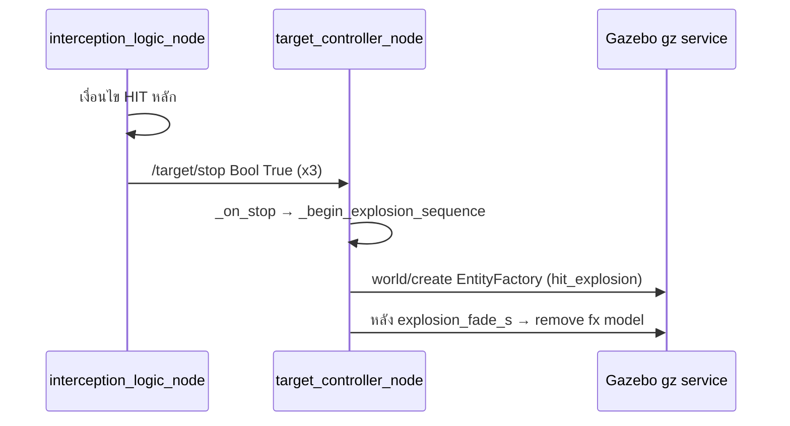

# Debug: HIT และเอฟเฟกต์หลังชนใน Gazebo

คู่มือไล่เมื่อ “ไม่เห็นระเบิดหลัง HIT” หรือไม่แน่ใจว่า HIT จริง — อ้างอิงโค้ดใน `gazebo_target_sim`.

## โฟลว์



- HIT: `interception_logic_node.py` — log `[HIT]`, `[RESULT]` และ `success=True`
- Stop: `_publish_stop_signal` — single-target มักใช้ `/target/stop` (param `stop_topic`)
- เอฟเฟกต์ Gazebo: `target_controller_node.py` → `_begin_explosion_sequence` → `gz service` create + `models/hit_explosion/model.sdf`

---

## 1) ยืนยันว่าตรรกะ HIT เกิดจริง

ค้นใน log (หรือไฟล์ log):

| สิ่งที่หา | ความหมาย |
|-----------|-----------|
| `[HIT]` | ตรรกะถือว่าชนแล้ว |
| `[RESULT]` + `success=True` | ผลลัพธ์หลัง HIT |
| `[HIT_BLOCKED_*]` / `[GUIDANCE_WARN]` | อาจไม่ส่ง stop หรือไม่เข้าเงื่อนไขชน |

**คำสั่งตัวอย่าง**

```bash
grep -E '\[HIT\]|\[RESULT\]|HIT_BLOCKED|GUIDANCE_WARN' your_run.log
```

ถ้าไม่มี `[HIT]` — แก้ engagement / feasibility / strike / `hit_threshold` ก่อน ไม่ใช่ที่ explosion

---

## 2) ยืนยันว่า target_controller_node ได้รับ stop

ใน log `target_controller_node`:

| สิ่งที่หา | ความหมาย |
|-----------|-----------|
| `Listening for impact on '/target/stop'` | สมัคร single-target topic |
| `Received '/target/stop' True — applying hit / stop sequence` | เข้า sequence ระเบิด |
| ไม่มีบรรทัดนี้หลัง `[HIT]` | topic ไม่ตรง, QoS, หรือโหมด multi (`/target_0/stop` ฯลฯ) |

**โหมด multi:** stop ไปที่ `multi_target_stop_topics` ตาม label — `/target/stop` อาจไม่ถูกใช้

**ROS (จับทันข้อความ)**

```bash
ros2 topic echo /target/stop --once
```

ที่แน่นอกกว่าคือ log `HIT: publishing ... True ×3` จาก `interception_logic_node`

---

## 3) ยืนยันการ spawn ใน Gazebo

ใน log `target_controller_node` หลัง HIT:

| สิ่งที่หา | ความหมาย |
|-----------|-----------|
| `[EXPLOSION] sdf_path=... exists=True` | พบไฟล์ SDF ใน share |
| `[EXPLOSION] gz create returned ok_sp=True` | spawn สำเร็จ |
| `exists=False` | build/install — `colcon build` + `source install/setup.bash` |
| `ok_sp=False` / `data: false` | `GZ_IP`, `world_name`, transport (\"Host unreachable\") |

ให้ชื่อ world ตรง launch (ค่าเริ่มต้น `counter_uas_target`) กับ `<world name=...>` ใน SDF

---

## 4) สร้างแล้วแต่มองไม่เห็น

- โมเดล FX ถูกลบหลัง `explosion_fade_s` (ปัจจุบัน ~12 s ใน launch / default node) — หมุนกล้องช้าอาจพลาด
- `hit_explosion` โปร่ง (`transparency` สูง) — ซูมไปจุด `Impact sequence at (x,y,z)` ใน log
- กล้องไกลหลาย km — ทรงหลายร้อยเมตรอาจยังดูจาง

---

## 5) แยกจาก RViz (optional)

Pulse ข้อความ HIT อยู่ที่ **`/interception/hit_markers`** — ไม่ใช่หลักฐาน Gazebo spawn

```bash
ros2 topic echo /interception/hit_markers --once
```

---

## 6) Checklist สั้น

1. มี `[HIT]` หรือไม่  
2. มี `HIT: publishing ... stop True` จาก `interception_logic_node` หรือไม่  
3. มี `Received ... stop True` จาก `target_controller_node` หรือไม่  
4. มี `[EXPLOSION] ... ok_sp=True` หรือไม่  
5. ถ้า 4 ผ่าน — พิกัด impact + fade + โปร่ง + มุมกล้อง  

ส่ง ~20–40 บรรทัด log รอบ `[HIT]` รวม `target_controller_node` เพื่อไล่ต่อได้เร็ว

## สคริปต์ช่วย

จากราก workspace:

```bash
./scripts/debug_hit_explosion_flow.sh your_run.log   # optional: grep log
```
